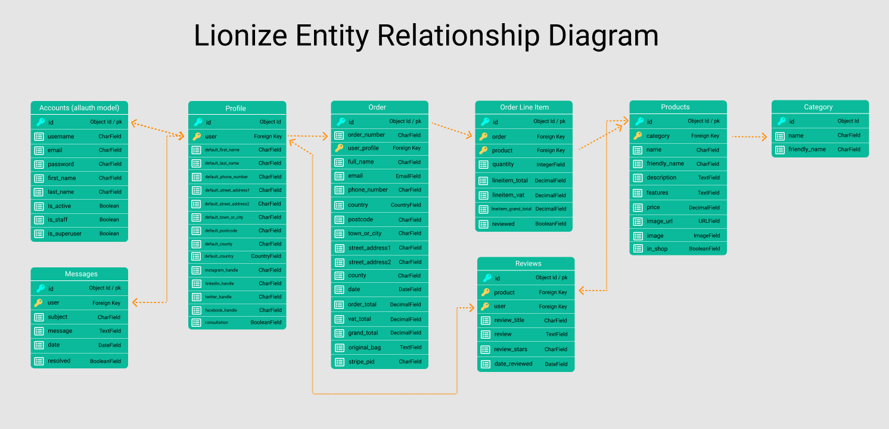
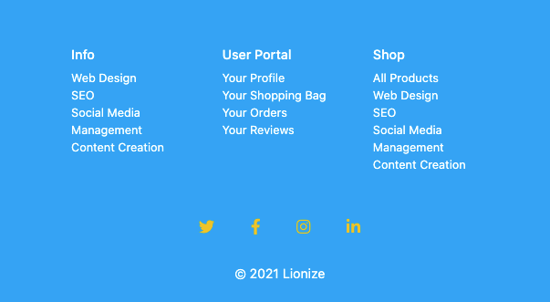
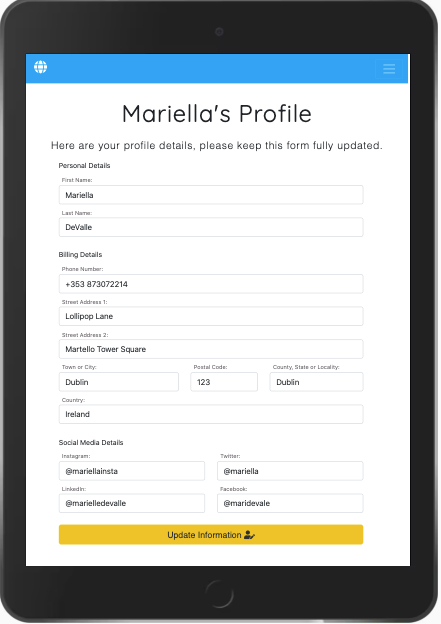
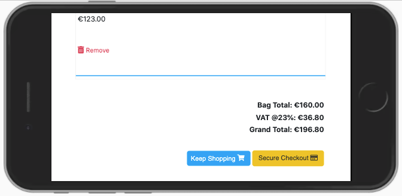
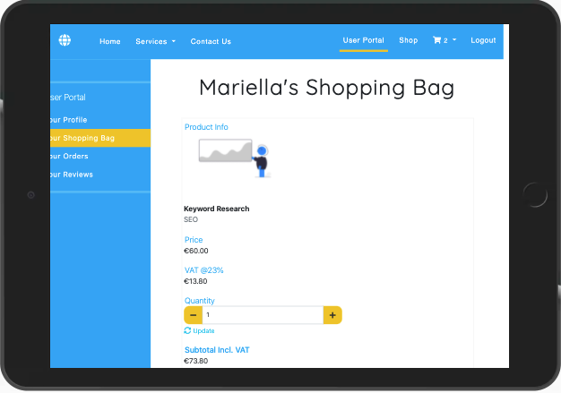
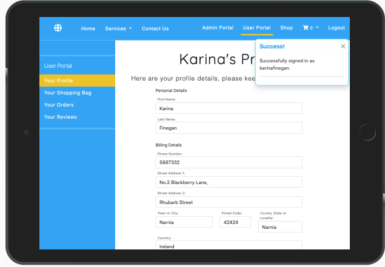
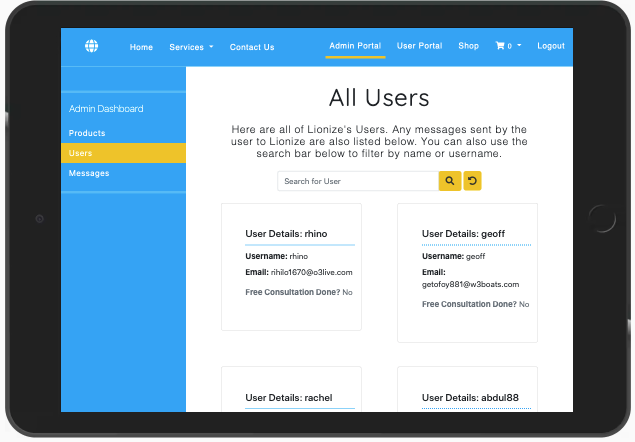
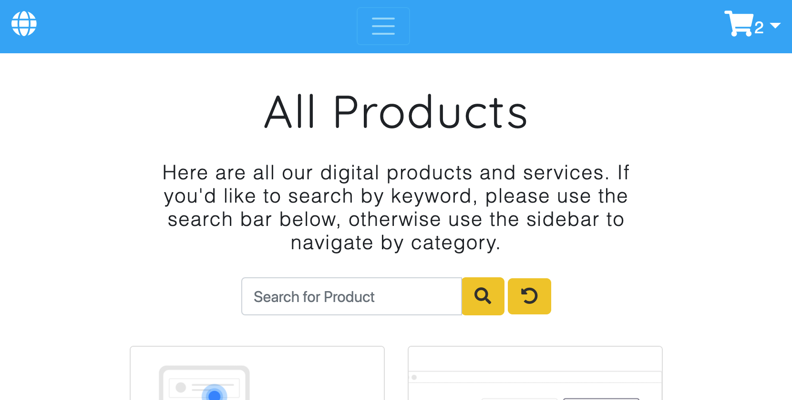

# Lionize

## Digital Marketing Solutions

## Code Institute Milestone Project 4

This project is an application and company website for a digital marketing business called "Lionize". The application both showcases the digital services offered and also allows clients to register a free account. Once registered the client is given access to further information about the services, as well as quote calculators and they also have the ability to order and pay for certain digital products online.
 

# Table of Contents

- [1. UX](#ux)
    * [User Personas - Four Examples](#user-personas-four-examples)
    * [User Stories](#user-stories)
      - [*First Time User Stories*](#first-time-user-stories)
      - [*Returning User Stories*](#returning-user-stories)
      - [*Persona Based User Stories*](#persona-based-user-stories)
      - [*Accessibility User Stories*](#accessibility-user-stories)
      - [*Application Creator User Stories*](#application-creator-user-stories)
  * [Strategy](#strategy)
      - [*Project Goals*](#project-goals)
      - [*Target Users*](#target-users)
      - [*Research*](#research)
      - [*Value To The User*](#value-to-the-user)
  * [Scope](#scope)
    - [*Core Theme*](#core-theme)
    - [*Feature Ideas Table*](#feature-ideas-table)
    - [*List of Final Features*](#list-of-final-features)
  * [Structure](#structure)
      - [*Interaction Design*](#interaction-design)
        - [*Navigation*](#navigation)
        - [*Consistency and conventions*](#consistency-and-conventions)
        - [*Learnability and Communication of Functionality*](#learnability-and-communication-of-functionality)
        - [*Feedback*](#feedback)
        - [*Messages Framework*](#messages-framework)
        - [*Form Validation Messages*](#form-validation-messages)
        - [*Deletion Confirmation Modals*](#deletion-confirmation-modals)
        - [*State Changes*](#state-changes)
        - [*Error Pages*](#error-pages)
        - [*Pre-Loader*](#pre-loader)
      - [*Information Architecture*](#information-architecture)
      - [*Application Sections*](#application-sections)
        - [Guest Users (not logged in)](#guest-users-not-logged-in)
        - [Guest User Flow](#guest-user-flow)
        - [Logged in Users](#logged-in-users)
  * [Skeleton](#skeleton)
      - [*Progressive Disclosure*](#progressive-disclosure)
      - [*Metaphorical Thinking*](#metaphorical-thinking)
      - [*Establishing Value Through Design*](#establishing-value-through-design)
      - [*Reassuring Conventions*](#reassuring-conventions)
      - [*Contextually Organised Content*](#contextually-organised-content)
      - [*Wireframes*](#wireframes)
  * [Surface](#surface)
      - [*Design Considerations*](#design-considerations)
      - [*Colour Palette*](#colour-palette)
      - [*Typography*](#typography)
      - [*Design Mockups*](#design-mockups)
- [2. Database Architecture](#database-architecture)
    - [Schema](#schema)
- [3. Features](#features)
- [4. Responsivity](#responsivity)
    - [Mobile Devices](#mobile-devices-materialize-sm-breakpoint)
    - [Tablet Devices](#tablet-devices-materialize-m-breakpoint)
    - [Desktop Devices](#desktop-devices-materialize-l-breakpoint)
    - [Wide Desktop Devices](#wide-desktop-devices-materialize-xl-breakpoint)
- [5. Accessibility](#accessibility)
    - [1. Accessibility for Users with Visual Impairments](#1-accessibility-for-users-with-visual-impairments)
    - [2. Accessibility for Keyboard Users](#2-accessibility-for-keyboard-users)
    - [3. Accessibility for Users with Hearing Impairments](#3-accessibility-for-users-with-hearing-impairments)
    - [4. Accessibility for Users with Cognitive Impairments](#4-accessibility-for-users-with-cognitive-impairments)
    - [5. Accessibility for Users with Slow Internet Connections](#5-accessibility-for-users-with-slow-internet-connections)
- [6. Security](#security)
    - [1. CSRF Protection](#1-csrf-protection)
    - [2. Flask-Talisman and Content Security policy](#2-flask-talisman-and-content-security-policy)
    - [3. Access Control](#3-access-control)
    - [4. Request Methods](#4-request-methods)
- [7. Testing](#testing)
- [8. Future Features To Implement and Issues Remaining](#future-features-to-implement-and-issues-remaining)
- [9. Attribution](#attribution)
- [10. Deployment](#deployment)
- [11. Tools and Other Resources Used](#tools-and-other-resources-used)
    - [1. Design](#1-design)
    - [2. HTML and CSS](#2-html-and-css)
    - [3. JavaScript](#3-javascript)
    - [4. Python](#4-python)
    - [5. Django](#5-django)
    - [6. Jinja](#6-jinja)
    - [7. General](#7-general)
- [12. Libraries](#libraries)
- [13. Technology Used](#technology-used)
- [14. Acknowledgements](#acknowledgements)

# UX

## User Personas - Four Examples

1. __Tom Lynch__ is a __sole trader__. He runs a tiny, stylish hipster coffee shop in Kinsale, Co. Cork. He is fairly tech-savvy and enjoys managing his social media accounts, but does not have the inclination or the time to develop his own website. A friend made one for him using a template site, but he doesn't feel like it reflects the quality of his business. He wants to hire a professional developer to better align his online presence with his offline business. He has a budget of €2,500 for this purpose.

2. __Annalise Maior__ is the __marketing manager__ of the national branch of a global real estate company. She is tasked with increasing the company's social media presence in Ireland, as several Irish companies have a much stronger following. Her budget for this goal is flexible but she expects a tangible, measurable improvement in their social media KPIs, specifically she wants to outdo the national businesses in terms of engagement and follows.

3. __Rosemary Geoghan__ is the __CEO__ of a mid-sized plumbing company based in Dublin. The business already has a strong industry reputation and its primary clients are large construction firms. Rosemary wants a client portal added to the business's existing website so that detailed and customized project information can be viewed easily by clients.

4. __David Murphy__ is a makeup artist based in Kildare. He is expanding his business and has launched a product line of branded makeup brushes. He wants to delegate both his social media management and his content creation, so that he can focus on strategy and his day-to-day business.

#### back to [contents](#table-of-contents) 
<br>

## User Stories

This application is targeted at Sole Traders, SMEs and larger businesses who are looking to outsource aspects of their digital marketing strategy. The services on offer include website creation, SEO services, social media management and content creation.

## First Time User Stories
## *As a first time user I want to be able to...*

1. Easily understand the purpose of the web application.
2. Quickly and easily understand how to navigate and access information on the website.
3. Quickly and easily have an idea of what kinds of products are offered.
4. View further details of each of the services on offer, on specific pages dedicated to that service, so as to decide if I want to avail of any of them.
5. View a website that is visually and creatively appealing and physically easy to look at.
6. Notice the login/register options and easily navigate to those pages.
7. Understand the purpose of user registration and the benefits thereof.
8. Easily register a free account using my email.
9. Receive an email confirmation of my registration.

## Returning User Stories
## *As a returning user I want to be able to...*

### Registration, Login, Logout, & Update Data

1. Login to my user account, using my email and password.
2. Be redirected to the User Portal and easily view the various custom user pages.
3. Edit my account information.
4. Recover my password if I forget it.
5. Logout of my account.

### Information Gathering

1. Quickly navigate to the products / services information pages from anywhere on the website.
2. Gather more in depth information about the services and products on offer.
3. Easily contact Lionize to ask for specific information about the services and products on offer.
4. Easily find the prices of all products.
5. View the reviews of other users on products/services I am interested in.

### User Portal

1. View / add / update my profile details easily on a page specifically for that purpose.
2. Navigate to my shopping bag quickly from the user portal side bar.
3. Easily view all my past orders, and all their attendent details.
4. View a list of my ordered and purchased products that I can review.
5. View a list of all the reviews I have written.

### Shopping

1. Browse all products.
2. Easily view the prices & specific details of each product by clicking into a product details page.
3. Browse products by category.
4. Filter products by keyword using a search form.
5. Add products to my shopping bag and have this visually confirmed for me.
6. Easily view all the items in my shopping bag.
7. Update the items in my shopping bag, by adding more or less of an item.
8. Remove any item from my shopping bag.
9. Make changes to my shopping bag and see these changes reflected immediately without having to visit the shopping bag page.
10. Email Lionize with a custom quotation request for a specific product/service I have in mind that I cannot find in the shop.

### Purchasing

1. Purchase the products I have added to my shopping bag.
2. Use my credit card to pay for my items.
3. Be confident in the knowledge that my payment is being handled securely.
4. View the VAT added to both the individual products and the total cost before paying.
5. Have my personal details such as name, email, phone number & address saved to my profile and automatically populate the checkout form.
6. See confirmation of my order after completing the checkout process.
7. Receive an email confirming my order after completing the checkout process.
8. Have the VAT reflected on the order confirmation.
9. Navigate to my order history page and easily see a list of past orders processed with all associated information clearly outlined.


## Persona Based User Stories

### Tom Lynch - Hipster Coffee Shop Owner
### *As a sole trading small business owner I want to be able to...*

1. Order a professional looking website for my small business.
2. See some examples of Lionize's web design work prior to ordering.
3. Easily understand all the various web design options available to me.
4. Easily communicate with Lionize about my requirements, my order and my billing.

### Annalise Maior - Real Estate Marketing Manager
### *As a regional marketing manager of a large corporation I want to be able to...*

1. Delegate the social media management of our Irish branch to specialists.
2. Improve all social media KPIs and see a measurable return on investment.

### Rosemary Geoghan - Plumbing Co. CEO
### *As the CEO of a plumbing company seeking to future-proof how we communicate with clients, I want to be able to...*

1. Order a new ecommerce site, with an easy-to-use CMS.
2. Get the project up and running and then delegate the project management & website administration to our marketing dept.

### David Murphy - Entrepreneurial Make-up Artist
### *As a createive professional whose brand is focused around my personality, I want to be able to...*

1. Confidently delegate social media management, secure in the knowledge that tone and content will be in keeping with my personal brand.
2. Delegate the content creation of blog posts for my website and to share on social media to increase and maintain follower engagement.
3. Easily pay for content creation products as I need them.

## Accessibility User Stories

- __*As a user who is colourblind*__, I want the colours and design elements used to employ sufficient contrast so that any visual cues are easily apparent.
- __*As a keyboard user*__, I want to be able to navigate the application using the keyboard.
- __*As a user using screen reader technology*__, I want my screen reader to describe the page elements correctly.

## Admin User Stories
### *As an application admin user I want to be able to...*

- Add a new product to the shop.
- Edit an existing product.
- Delete a product from the shop.
- See a list of registered users and any emails they have sent to Lionize.

## Application Creator User Stories
### *As the application creator and Lionize business stakeholder I want to be able to...*

- Create and maintain a user-friendly platform allowing business owners, stakeholders and employees to easily see and understand the services on offer.
- Ensure that the application is as accessible as possible to include as wide a variety of users as possible.
- Accept online payments from users.
- Increase Lionize's client base and profits through use of the website and associated ease of online orders.

#### back to [contents](#table-of-contents) 
<br>

# Strategy

## Project Goals
To create a web application that successfully showcases Lionize's services and offers clients access to a B2B order and payment portal, that both enhances their user experience *and* increases Lionize's customer loyalty and trust.

## Target Users
As outlined above Lionize's target market are businesses in need of digital marketing services. SMEs, sole traders and larget corporations all fall under this umbrella.

## Research

To research the best design and structural mechanisms to use for this project, I visited a number of Saas and online store websites to see how they present their information and how they structure their payment portals.

## Value to the User
All classes of users benefit from a simple online ordering and payment system.

The informational aspects of the website deliver value insofar as they succinctly communicate information about the services/products on offer, allowing potential clients to make informed purchasing decisions.

The user portal access gained after registration delivers a more personalized, efficient user experience that is in sync with the fast pace of technological innovation.

#### back to [contents](#table-of-contents) 
<br>

# Scope

## Core Theme
The crux of this application's purpose is as a B2B service provider that allows clients to register and login and access an order and payments portal that makes doing business with Lionize streamlined and easy.

## Feature Ideas Table

 #|Opportunity/Potential Feature | Importance | Viability | Score
---|------------ | -------------|--------------|------------------
. | __*GUEST USER FUNCTIONALITY & FEATURES*__
1.| Browse the website easily and view separate pages for each service offered.  | 10 | 10 | 20
2.| Contact Lionize with questions. | 9 | 10 | 19
. | __*APP NAVIGATION FUNCTIONALITY & FEATURES*__
1.|  There is a main navbar with links to the homepage, the service details pages & the contact form for unregistered users. |10|10|20
2.| The main navbar changes to include links to the Shop & the User Portal for logged in users and a link to the Admin Portal for admin users. |9|8|17
3.| When a user has navigated to any of the user portal, shop pages, or admin portal, there is a second side navigation on desktop with all the attendent links. | 8 | 8 |16
4.| On mobile the above links are nested within the hamburger navigation. |7|8|15
5.| On mobile, there is a cart icon at the same level as the hamburger navigation, allowing quick access to a dropdown summary of the shopping cart contents. |8|6|14
. | __*USER REGISTRATION FUNCTIONALITY & FEATURES*__ 
1.| Register as a new user  | 10 | 10 | 20
2.| Register using an email address | 7 | 10 | 17
3.| Confirm password when registering | 7 | 7 | 14
4.| Register a username as separate from login email | 3 | 9 | 12
5.| Receive an email link to confirm the user is supplying a genuine email address |3 | 5 | 8
. | __*USER LOGIN / LOGOUT FUNCTIONALITY & FEATURES*__ 
1.| Users can login with email and password |10 | 10 | 20
2.| When a user logs in, they are brought to a user portal |7 | 10 | 17
3.| A session is started and the user's login status is remembered as they use the application |9 | 9 | 18
4.| When a user is logged in they can view their profile information, order history and reviews.  |10 | 9 | 19
5.| A user has to be logged in, in order to acccess their user portal, order history and reviews. |10 | 9 | 19
6.| A user can logout to end their session. |10 | 10 | 20
. | __*USER PORTAL FUNCTIONALITY & FEATURES*__ 
1.| The user portal consists of any information personal to that specific user. |6 | 10 | 16
2.| Users can view a form of their profile / billing information and they can edit the same. |6 | 6 | 12
3.| Users can view their current shopping bag. |8 | 8 | 16
4.| Users can view a list of all their past orders. |5 | 8 | 13
5.| Users can click into view the details of any of these past orders. |5 | 7 | 12
6.| When a user logs out, their shopping bag information is saved to their user profile and remembered when they log back in. | 4 | 2 | 6
7.| Lionize can upload designs, contracts and other files so that they are accessible to users from their dashboards. |2 | 3 | 5
8.| Users can add widgets of their social media accounts to their user portal to view their accounts while inside the application. | 2 | 3 | 5
9.| Users can view a list of products they have previously ordered and that can be reviewed. | 6 | 6 | 12
10.| Users can view a list of their reviews. | 5 | 7 | 12
. | __*SHOP FUNCTIONALITY & FEATURES*__ 
1.| Users can order digital products directly from the user portal / shop area. |6 | 6 | 12
2.| The shop is divided into 4 categories of products: Web Design, SEO, Social Media Management & Content Creation. |4 | 5 | 9
3.| Users can filter the products on the "All Products" shop page by searching for a particular keyword.  |6 | 6 | 12
4.| Users can view an overview of all the products in a specific category on that categories. |9 | 8 | 17
5.| Users can view reviews on products. |6 | 7 | 13
6.| Users can click in to see details of the products they are interested in. |7 | 8 | 15
7.| Users can see the VAT amount added to each product. |6|7|13
8.| Users can add products they want into a shopping bag. |10|10|20
9.| Users can navigate to a shopping bag page and easily see all the products they have added. |10|10|20
10.| Users can update & remove items from their shopping bag. |9|9|18
11.| Users get immediate feedback in the form of messages on screen when they alter their shopping bag in any way. |8|8|16
12.| The VAT added to the products is visible for each individual product & the total amount of VAT on the shopping bag page. |7|7|14
13.| Users can pay securing using a credit card. |10|10|20
14.| If a user has saved their profile / billing information, the checkout page form is auto-populated with this info. |8|8|16
15.| When a user successfully purchases a product, a confirmation email is sent to their email. |8|8|16
16.| If a user enters incorrect card information they are informed of this immediately via an error message. |8|6|14
. | __*ADMIN FUNCTIONALITY & FEATURES*__
1.| Admin can add, edit & delete products on the backend of the application. |9 | 10 | 19
2.| Admin can add, edit & delete products on the frontend of the application. |6 | 9 | 15
3.| There is an admin dashboard page where they can add new products & view a list of users. |4 | 4 | 8
4.| Admin can mark a product as "on sale". |4 | 4 | 8
5.| Admin can mark a product as "new". |4 | 4 | 8
6.| On the admin user dashboard page, admins can view a full list of users as well as some user details & any emails a particular user has sent Lionize. |5 | 5 |10
7.| Admins can filter the list of users using a keyword search. |5|5|10
8.| On the admin product dashboard page, admins can filter products by clicking on a category button or by keyword search. | 6|6|12
. | __*OTHER FUNCTIONALITY & FEATURES*__
1.| Users can upload / select palettes & typography they like for their web design projects. |2 | 2 | 4
2.| Users can create a mood board from images they upload to help Lionize with the design process. |2|1|3
3.| When "new" products are added by admin, the application automatically adds them to a promotional banner that sits across the top of the "All Products" page in the shop. |3|6|9

<br>

 ## List of Final Features 
 *(for an MVP)*

 The features I decided to create an MVP version of this application with are the following:

### Information Gathering & General Browsing
1. Guest users should be able to easily browse the website and view general information on the kinds of services/products on offer. 
2. They should be able to use a fully functioning contact form to contact Lionize with any questions. 
3. The navigation should be slightly different with more options for logged in users, including a second side nav for the user portal, shop & admin sections of the site.
4. Logged in users should be able to read the reviews of other users on products they are interested in.
### Registration, Login & Logout
4. Users are able to register easily using an email address and separate username, and they must confirm their password when registering.
5. Once registered they should receive an email confirmation link to ensure they are supplying a genuine email address and then they should receive an email confirmation of successful registration.
6. Users should be able to login and logout.
7. When a user starts a session their login status and shopping bag should be remembered as they use the application.
8. Once logged in a user should be able to view the user portal pages which include: their profile/billing details, their current shopping bag and a list of their past orders.
9. When logged in users also have access to the Shop.
10. Users MUST be logged in to access the user portal pages and the shop.
### User Portal
1. Users can view & change their profile information for use with billing and other app functionality.
2. Users can click in to see their shopping bag.
3. Users can view a list of their past orders.
4. Users can view a list of items availble for them to review.
5. Users can view a list of their reviews.
### Searching & Filtering
1. Users can view categories of products to shop using a side navigation bar.
2. Users can perform a keyword search against the product names, descriptions & features.
3. Admin users can filter users by keyword search & can filter products using category buttons or keyword search.
### Shopping
1. Users can shop directly from the user portal / shop area of the application.
2. When shopping, users can view the lists of all products (whether in the all products section of divided by category) and they can click into view the specific product details and to add it to their shopping bag if they want. 
3. Users can see the VAT amount on individual products in their shopping bag as well as the total VAT being charged.
4. Users get instant confirmation of any changes to their shopping bag via a modal message on the page.
5. Users are able to close the modal.
### Payment
1. Users can navigate to a checkout page when they are ready to pay securely using a credit card.
2. The user's billing details will be auto-populated in the checkout form if they have previously saved them.
3. When a user successfully purchases a product they are sent a confirmation email with all the details.
4. If any errors occur during the checkout process the user is informed of the error.
### Admin Functionality
1. Admins can add, edit or delete products on the front & backend of the application.
2. Admins can view a list of all users on the front-end of the application.
3. Admins have access to two dashboards: one for products, one for users & they can filter the results of both.

These are the features I determined necessary for the first iteration of this application, with scope to increasing them down the road.


 #### back to [contents](#table-of-contents)
 <br>

# Structure

The structure is somewhat non-linear as the navigation is flexible and depedent on whether a user is registered and logged in or not. Navigation and user flow also differs for admin vs. regular users.  I was aware of the importance of maintaining a level of simplicity as because of its' multi-layered structure I wanted all the pages to be evident and easily accessible for users. I was careful to ensure that both the information architecture and design was intuitive and as simplified as possible. To this end I was careful to include ample feedback in the form of toast messages, well designed error pages and confirmation modals for admin product deletion. 

## Interaction Design

### Navigation

Navigation is straightforward: for unregistered users there is a top navigation bar on desktops and a hamburger dropdown on mobile & tablets. The navigation for unregistered users directs them to register & then login to their account.

Once logged in, the user is brought to the user portal / shop pages, where a side nav bar is added to the top navigation.

The back button is never relied on, but it is used to enhance and simplify the user experience. For example when a user has navigated to the product details page they *could* just use the sidebar to get back to products, but the back button is more directly and obviously connected to where they may want to go.

<p align="center">
  
</p>

When on the "All Products" page, users can perform a keyword search against the product name, description and features. I also chose to give the different categories of products their own separate pages and views (rather than using Q Objects as with the keyword search) to ensure the best possible SEO performance.

Navigation is also further enhanced and clarified by use of proper active page highlighting. I custom coded this aspect of navigation to make it perfectly logically consistent on both navigation bars (top & side). For example, if a user is viewing their order history, they are in the User Portal and they are on the order history page, therefore both of these navigation items will be highlighted:

<p align="center">
  
</p>

### Consistency and conventions

All content, navigation, typography and information hierarchy are consistent and predictable in nature. The user shopping experience does not deviate from what most users will be used to from their online shopping experience to date. The checkout process likewise follows a predictable formula. 

- All of the most important content is visible on the page and should a user need to scroll this is made amply evident to them.
- The application's aesthetics are consistent throughout the site and rely on the same small set of colours and fonts.
- Spacing is used to create a clean aethestic and the application never feels crowded or claustrophobic.
- All fonts used a clean and elegant sans-serif.
- Icons (such as the search magnifying glass and the airplane send email icon etc..) are used to enhance metaphorical thinking.
- Images are used to the same effect as above. Each product has an associated illustration that reflects the content of the product itself to futher reassure the user.
- All forms rely on labels and / or placeholders to guarantee the user knows what they are doing at all times.
- The formula of long product list ---> product detail page is used because users will be familiar and happy with this structure.
- The navigation organisation mirrors that of large ecommerce sites so that the user will also have prior knowledge of that formula.

### Learnability and communication of functionality

- Because of all of the above consistent and convention attributes, learnability is very high and quick for this application.
- There is very little about it that the user will not be expecting or anticipating.
- On all pages that require the user to *do* something, what they are expected to do, is clearly and succinctly explained.

The name of the application itself communicates the essence of what the business does. "Lionize" means to enhance something's or someone's fame and standing in the world. This is followed by a further explanation of the business's raison d'etre. Scrolling down further elucidates what is on offer by grouping and summarizing the four different categories of products. Each of these product / services introductions can be clicked on to view more details. This process of unfolding follows formulaic lines and is structured this way so as to first pique the user's interest and then slowly feed them more information without overloading them. Once they learn about the products they are then told explicitly why they should register and ideally the homepage user flows ends here, with them clicking the "Register" button. Should they choose to keep scrolling there is an introduction to the main stakeholders in the business and then a contact form should they wish to get in touch to ask any questions.

### Feedback

- Most actions a user can do on the application are followed by various forms of immediate feedback.
- Clicking the logout button brings the user to a logout confirmation page and then when they confirm their logout intent, they see a toast message telling them they have successfully signed out.
- Registration is confirmed via email.
- Logging in brings the user directly to their user portal as well as delivering a login confirmation message via toast that communicates both the action and reassures them of its accuracy with the inclusion of their username in the message content itself.
- Adding anything to the shopping bag pops up a small toast modal that confirms the addition.
- On the shopping bag page, if a user chooses to remove an item from their bag, this is also confirmed via a toast message.
- When the order is being processed after checkout, a page loading icon informs the user that something is happening.
- When the order is processed the user is brought to the order success page and also sees an order success toast. A confirmation email is also sent to them.
- When the user adds a review, a toast message pops up thanking them for doing so.

<p align="center">
  
</p>

- If a user emails Lionize using the contact form, they also see a message telling them that the email was successfully sent, alongside some important GDPR related information.

<p align="center">
  
</p>

### Messages Framework

- As abovementioned users are given feedback in the form of Bootstrap's toast messages after all major actions.
- This informs them of the success (or failure) of their actions.

### Form Validation Messages

- The register, login and checkout forms include form validation that immediately communicates a message back to the user if they either fail to complete a required field or complete a field incorrectly.
- If the user attempts to log in with incorrect details the message delivered is above the form and in red to communicate the error clearly.

### Deletion Confirmation Modals

If an admin user chooses to delete a product, they are asked to confirm this deletion via a pop-up modal. This adds an extra level of protection against accidental deletion.

### State Changes

- All buttons have hover styles applied to reassure the user of their action.
- All links and interactions have visible state changes to ensure the user knows their action is working properly.

### Error Pages

There are a number of specific error pages that cover the gamut of common errors a user might encounter. The pages are all clear as to what the error was and why it was thrown.

### Pre-Loader

<br>

## Information Architecture & User Flow

This application is mostly non-linear in its narrative form. Both first time and logged in users are able to browse the application at their leisure and any linearity is limited to the intended encouragement for first time users to register. This can be simply illustrated by:

        Information ---> Registration

That is the intended user flow for unregistered users, but it is not reflected in the structure, they are free to navigate within the site parameters available to them.

For registered users, this flexibility is enhanced further, they are able to browse, navigate the user portal and there is only lineaity of flow when it comes to actually purchasing a product or products. Then the flow is:

            Shopping Bag ---> Checkout ---> Payment ---> Order Confirmation

And then they are free to browse the application again it whatever manner they see fit.

The biggest departure from accepted convention in terms of ecommerce, is not allowing guest users to view the shop without registering. This was done intentionally and is a valid marketing strategy for larger priced products. The idea is to cultivate 
engagement through a lack of detailed information, forcing users to register by piquing their interest.

<br>

#### back to [contents](#table-of-contents) 
<br>

# Skeleton 

## Progressive Disclosure

As touched upon in the Structure section the homepage utilizes progressive disclosure to slowly unveil what the application is about, what kind of services/products are for sale and what is expected of the user. The information is delivered piecemeal at first and expanded only *if* the user is interested enough to click on the "Learn More" buttons.

## Metaphorical Thinking

Icons and illustrations are used throughout the application to enhance and reinforce the messages behind the actions required.

## Establishing Value Through Design

Value is established by ensuring consistency in design and typography, the colour scheme and design elements are consistence throughout and thus the user knows to trust the quality of what is on offer. Space is also used to create a feeling of freedom and clarity, which I think is very important when it comes to ecommerce. Nothing is more off-putting than a crammed online shop.

## Reassuring Conventions

As aforementioned in design and structure and feedback, I've kept everything about the application predictable and conventional. The level of user trust needs to be exceptionally high for any application that is seeking to sell something and take user payment information.

## Contextually Organised Content

I've also been careful to organise the content and information in contextually appropriate ways. On the homepage for example, all the information pertaining to the categories of products are grouped under a "Services" navigation dropdown menu, rather than displayed separately. Within the user portal the user portal pages are clearly separated from the Shop pages by a line divider on desktop and they are under a separate heading on mobile.

## Wireframes

The best way to view all the wireframes, user flows, mockups, colour palette & typography for this application is by visiting my [public Figma workspace here.](https://www.figma.com/file/PeEEgePG0JpxThhMTRARTu/lionize?node-id=13%3A41)

Alternatively here are the individual wireframes:

1. [Mobile Wireframes](static/images/wireframes/lionize-mobile-wireframes.pdf)
2. [Tablet Wireframes](static/images/wireframes/lionize-tablet-wireframes.pdf)
3. [Desktop Wireframes](static/images/wireframes/lionize-desktop-wireframes.pdf)

If you do opt to view them this way, please click download as the GitHub viewer can expand the smaller files to an uncomfortably large zoom ratio.

<br>

#### back to [contents](#table-of-contents)
<br>

# Surface

## Design Considerations

My aim was keep the design as simple, clear and open as possible. I think light tones have a more transparent and trustworthy quality for e-commerce and as the business is service / digital based, I thought a light blue tone worked perfectly with yellow as the main colours. Space and clarity were the two driving factors behind the design I opted for and I think they achieve those perception aims well.

## Colour Palette

<p align="center">
  
</p>

## Typography

I played it really safe with the typography, I thought Quicksilver worked well for the headings and everything else is a permutation of Open Sans. My intent was to use typography to deliver the message of consistency and safety. Perhaps a little dull, but I think that's ok for ecommerce.

<p align="center">
  
</p>

## Design Mockups

I haven't done extensive mockups, rather I have chosen a selection of important pages and limited my mockups to them for a desktop view. As my wireframes are relatively detailed and the colour theme and design does not change dramatically from page to page, I felt that these five mockups were sufficient to get a clear picture of what I would build.

Again, the best way to view these is by visiting my [public Figma workspace here.](https://www.figma.com/file/PeEEgePG0JpxThhMTRARTu/lionize?node-id=13%3A41) - As well as the Mockups linked below, the Figma link also has pages dedicated to first draft mockups and style ideas. 

[Alternatively click here for the individual mockups.](static/images/mockups/lionize-mockups.pdf)

Again, please remember to click download as the GitHub viewer can expand the smaller files to an uncomfortably large zoom ratio.

<br>

#### back to [contents](#table-of-contents) 
<br>

# Database Architecture

## Schema

A relational database was used to structure this project. Relational databases are perfect for ecommerce platforms where the relationships are easy to define ahead of use and they are unlikely to change.

For development SQLite was used and Postgres was used for the deployed project. The relationships in the database are kept as simplified as possible to maintain good structural integrity and transparency. Wherever possible, constraints were defined to maintain data integrity. I tried to minimize redundancy as much as possible, the only obvious outlier being that I duplicated the first_name & last_name variables of the Django auth model in the profile model, but that was in order to enhance user experience, so I decided it was a valid concession.

As you will see below the relationships mapped have an *almost* linear archictecture, whereby the Django __allauth model__ leads into the __UserProfile__ model with a One-to-one relationship. This model represents users who can create __Orders__ which can have various __OrderLineItems__ each of which has an associated __Product__ which belongs to a specific __Category__. Futhermore, those __Products__ can also be __Review__(ed) by __UserProfiles__ who can also email Lionize __Messages__.

These relationships and the details of their associated models have been further outlined below:

### __Account__

The allauth Django Account app includes a number of models however as I did not create these, I will not expand on them here, their purpose is to act as the basis for user authentication.

### __Category Model__

I intentionally created a Category model separate from the Product model for allowing an easier future expansion of product types / services offered. My thinking is that were I to eventually add subscription services, the Category model can be added as a Foreign Key, and not duplicated.

<br>

| Name | Data Type | Purpose |
| ---- | ----- | --------------- |
| name | string | The product category's "unfriendly" name. |
| friendly_name | string | The product category's human readable name.|


<br>

### __Product Model__

The product model stores the product specific data and is mainly used for product display purposes on the site, but is connected to both the Category & the Order Line Item models.

| Name | Data Type | Purpose |
| ---- | ----- | --------------- |
| category | foreign key | The product's category. A foreign key identifying which of the 4 categories this product belongs in. |
| name | string | The product's "unfriendly" name. Keyword searchable to users. |
| friendly_name | string | The product's human readable name. Keyword searchable to users. |
| description | string | The product's description. Keyword searchable to users. |
| features | string | A list of the product's key features. Keyword searchable to users. |
| price | decimal | The product's price as a decimal number with two decimal places. |
| image_url | string | The product's url. |
| image | string | An image associated with the product. Stored as a varchar file path. |
| in_shop | boolean | A boolean field designating whether or not the product is visible in the shop. Defaults to true.|

<br>

### __Review Model__

The review model stores the product reviews by users who have purchased them.

| Name | Data Type | Purpose |
| ---- | ----- | --------------- |
| product | foreign key | The product under review. |
| user | foreign key | The user doing the reviewing. |
| review_title | string | The title of the review. |
| review | string | The review itself. |
| review_stars | string | The review rating from 1-5. |
| date_reviewed | date | The date the review took place. |

<br>

### __Order Model__

The order model stores the specific order details and is connected to the order line item model and the user profile.

| Name | Data Type | Purpose |
| ---- | ----- | --------------- |
| order_number | string | A unique order number created by a method on this model using UUID. |
| user_profile | foreign key | A many to one foreign key relationship with a user profile. A user may have many orders. |
| full_name | string | The user's full name. |
| email | string | The user's email address. |
| phone_number | string |  The user's phone number. |
| country | string | The user's country, selected from a dropdown menu. |
| postcode | string | The user's postcode. |
| town_or_city | string | The user's town or city. |
| street_address1 | string | The first line of the user's address. |
| street_address2 | string | The second line of the user's address. |
| county | string | The user's county. |
| date | date object | The date the order was placed. |
| order_total | decimal | The total price of the order ex. VAT to 2 decimal places. |
| vat_total | decimal | The total VAT attached to the order to 2 decimal places. |
| grand_total | decimal | The total price of the order incl. VAT to 2 decimal places. |
| original_bag | string | The user's shopping bag stringified. |
| stripe_pid | string | The user's stripe pid (payment intent id). |


<br>

### __Order Line Item Model__

The order line item model stores the specific details of each unique item in an order, if the order contains multiple items of the same product it stores those as 1 line item but increases the quantity. It is connected to the Order and Product models.

| Name | Data Type | Purpose |
| ---- | ----- | --------------- |
| order | foreign key | A many to one relationship with the order itself. One order can have many line items. |
| product | foreign key | A many to one foreign key relationship with a product. A product may be ordered many times. |
| quantity | integer | The number of this product ordered for this order. |
| lineitem_total | decimal | The total price ex. VAT for this item to 2 decimal places.  |
| lineitem_vat | decimal | The total VAT for this item to 2 decimal places.  |
| lineitem_grand_total | decimal | The total price incl. VAT for this item to 2 decimal places.  |
| reviewed | boolean | Whether or not the order line item has been reviewed by the user who purchased it.  |

<br>

### __Profile Model__

The Profile model stores additional user data for information and billing that is not saved by the allauth User model. It is connected on a one to one basis to said User model as well one a one to many basis with the Order model.

| Name | Data Type | Purpose |
| ---- | ----- | --------------- |
| user | foreign key | A one to one relationship between the profile model and the allauth User model |
| default_first_name | string | The user's first name. |
| default_last_name | string | The user's last name. |
| default_phone_number | string | The user's phone number. |
| default_street_address1 | string | The first line of the user's address. |
| default_street_address2 | string | The second line of the user's address. |
| default_town_or_city | string | The user's town or city. |
| default_postcode | string | The user's postcode. |
| default_county | string | The user's county. |
| default_country | string | The user's country, selected from a dropdown menu. |
| instagram_handle | string | The user's Instagram username. |
| linkedin_handle | string | The user's LinkedIn username. |
| twitter_handle | string | The user's Twitter username. |
| facebook_handle | string | The user's Facebook username. |
| consultation | boolean | Whether not not the user has availed of their free consultation. |

<br>

### __Message Model__

The Message model stores all emails send by registered users via the contact form on the application, in order that admin might have a decent record of any questions or issues that arise and have those issues directly connected to the user that raised them.

| Name | Data Type | Purpose |
| ---- | ----- | --------------- |
| user | foreign key | A one to one relationship between the messages model and the UserProfile model |
| subject | string | The email subject. |
| message | string | The email message. |
| date | date object | The date the email was sent. |
| resolved | boolean | A boolean to keep track of whether the question was answered or issue resolved. |


## Entity Relationship Diagram
<br>


[Click here to view my ERD on Figma.](https://www.figma.com/file/PeEEgePG0JpxThhMTRARTu/lionize?node-id=39%3A2) I have also added it below, but the Figma link is zoomable.

<br>

<p align="center">
  
</p>

<br>

#### back to [contents](#table-of-contents) 
<br>

# Features 

## 1. Home

The landing page's aim is to deliver a strong and positive first impression to the user and to clearly explain the application's purpose and how it works. It also guides the user towards registering.

<details>
<summary><b>click for features</b></summary>

<br>

### Guest User

- Introduces the concept of the website by starting with a strong title and clean elegant design.
- A business synopsis is featured directly under the main heading.
<br>

<p align="center">
  
</p>

<br>

- Login & Register buttons are clearly visible both on the top navbar (desktop) and as the user scrolls down they arrive at
- The "Benefits of Registration" section which encourages them to register.

<br>

<p align="center">
  
</p>

<br>

- Links to each of the services / product categories are present early on in the user's homepage scrolling.
- Information about the main stakeholders in the company is also outlined on the homepage to increase trust in the business and to put human faces on the company.

<br>

<p align="center">
  
</p>

<br>

- At the bottom of the page is a contact form to communicate with the business.

<br>

<p align="center">
  
</p>

<br>

### Registered & Logged in Users

- The "Login" & "Register" buttons disappear from the navbar and the "Benefits of Registration" changes into a "Thank you for Registering" section with pertinent information and a link to set up the client's free consultation.

<br>

<p align="center">
  
</p>

- Clicking the link will pre-fill the contact form to email about a consultation.

- If the user has already availed of the free consultation they will see a different message telling them that, and giving them 
the option of paying for another consultation. 

<p align="center">
  
</p>

- I didn't really see the need to alter the homepage by removing this message for admin users, as by dint of them being admin, improving their user experience in
terms of the logic of the application's messages is not high up on the priority list. Essentially, administrators will understand that they don't need to book
a free consultation, so I see no reason to alter that aspect of the homepage to cater specifically for them.

</details>

<br>

## 2. Contact

The contact form is available for both unregistered and registered users. It allows users to contact Lionize with any and all
questions they might have and it is essential to creating trust in the business.

<details>
<summary><b>click for features</b></summary>

### Guest User

- Works as a simple contact form, guest users fill in their details and send an email.
- They receive feedback in the form of a toast message when the email sends successfully.

### Registered & Logged in User

- When a user is logged in, the "email" value of the form is prefilled for them to save them time and energy.

<br>

<p align="center">
  
</p>

<br>

- When a user is logged in and has not yet availed of their free consultation and clicks on the "Schedule Consultation" button, the form is auto-populated with the following data:
1. The user's email.
2. The subject: "Schedule free business consultation for first_name last_name." (Where the user's first and last names are auto-populated)
3. The message: 

        Dear Lionize,
        I would like to take this opportunity to schedule in my complimentary business consultation.
        The best date & time for me would be ...... [Please edit HERE to suit your schedule].
            
        In advance of our meeting here is my current business website: [Please enter website here if you have one, otherwise delete this line.]
            
        Here are my social media handles:
        Instagram: @karinainstagram
        Twitter: @karinatwitter
        Facebook: @karinafacebook
        LinkedIn: @karinalinkedin
            
        My phone number is: 32746283746832 should you need to contact me.

        Thank You,
        Karina

All the specifics are auto-populated from data the user enters or left blank if the user has not entered that information.

<br>

<p align="center">
  
</p>

<br>

- The contact form's functioning is connected to the Messages model, so that when a registered and logged in user sends an email,
it is stored in the database and connected to their UserProfile, in order to help Admin manage accounts effectively.

- In line with GDPR legislation, the message a logged in user receives upon sending an email informs them of this:

<br>

<p align="center">
  
</p>

<br>

</details>

<br>

## 3. Services Information Pages

These pages are identical for unregistered and logged in users alike. Their purpose is to act as informational general introductions to the kinds of products on offer, without outlining those products specifically and without listing prices.

<details>
<summary><b>click for features</b></summary>

<br>

They are meant to guide the unregistered users towards wanting to learn more and thus registering for free. They all reiterate that Lionize offers products for *all* industries. One of the barriers to user engagement is when user's (specifically SMEs) think they are "too small" to avail of certain digital products.

<br>

<p align="center">
  
</p>

<br>

The web-design page presents a few small thumbnails of previous work, this is not meant to be a comprehensive portfolio although it could certainly be expanded into such. Primarily these examples are just intended as another piece of encouragement towards registration.

Alongside the repeated "register with us" call to action that is on each of these information pages. Every page summarises the vague product types available using colourful bullet points. They also emphasise the company's expertise and high level of technical proficiency. These pages are a key mechanism in the strategy of progressive disclosure intended to expertly guide users towards "using".

<br>

<p align="center">
  
</p>

<br>

</details>

<br>

## 4. Navigation

Navigation has been divided into a main navbar and a side navbar for logged in users. This division's purpose is dual:
Firstly to simplify the contextual ordering of the different pages and secondly to create a sort of user portal / dashboard *feel* to the application. There is also footer navigation.

<details>
<summary><b>click for features</b></summary>

<br>

### Guest Users

For guest users the navigation is limited to the main navbar and the footer navigation.

<br>

<p align="center">
  
</p>

<br>

As you can see above, the login link is highlighted to look like a button, to differentiate it from register, and to emphasize the relevance of logging in.

On mobile devices the top navbar is accessible via the Hamburger icon.

<br>

<p align="center">
  
</p>

<br>

Great care as been taken to ensure that the active page navigation links are highlighted correctly to ensure great user experience. This has not been applied to the footer however, just the top & side navigation bars, as users don't tend to use footer navigation to reference what page they are currently on.

<br>

<p align="center">
  
</p>

<br>

### Logged in Users

- The side nav kicks in to play for logged in users, creating that desired dashboard / application effect. 
- The pertinent active navbar and side-nav links are underlined programatically using JavaScript.
- You can also see the addition of the shopping cart navigation icon, which displays the current number of items in the cart.

<br>

<p align="center">
  
</p>

<br>

- The shopping cart navigation dropdown includes a number of pricing & product details as you can see below.
- This provides excellent user experience and an easy reference point for users browsing and shopping.

<br>

<p align="center">
  
</p>

<br>

- This functionality is mirrored and slightly altered in the mobile version of the navigation.
- The side nav links become dropdown options on mobile:

<br>

<p align="center">
  
</p>

<br>

- The cart dropdown is almost identical on mobile, although it shrinks a bit to fit on smaller mobiles such as the iphone5 & old SEs.
- Also, it sits next to the hamburger icon on mobile, rather than alongside the rest of the links.
- This was to ensure that it was super accessible to users as they shop.
- It is also only present on mobile *if* the user has an item in their shopping bag.

<br>

<p align="center">
  
</p>

<br>

### Back Button Navigation

- Back buttons are used to enhance user experience, but they are an addition to, not a replacement for, the regular ever-present side & top navbars. 
- For example if a user clicks into view the product details a category section of the Shop, they are offered a "Back to SEO Products" back button link, which highlights when hovered over.

<br>

<p align="center">
  
</p>

<br>

- They could just as easily click the "Shop SEO" on desktop, however on mobile devices, the back button adds additional ease of use, as the "Shop SEO" Link is only accessible via the Hamburger drop-down menu.

<br>

<p align="center">
  
</p>

<br>

- The custom Error pages also use back buttons to quickly lead users back to the safety of the homepage:

<br>

<p align="center">
  
</p>

<br>


</details>

<br>

## 5. Register

The guest user is guided towards this registration page, which acts as the gateway to most of the application's more
advanced functionality, including the shop. The registration form in intentionally simple, so as not to put users off at 
the final hurdle. More detailed user information is collected later using the User Profile page.

<details>
<summary><b>click for features</b></summary>

<br>

- The register form asks for the user's email twice (to avoid typos), their username once and their password twice.

<br>

<p align="center">
  
</p>

<br>

- Once they click to register, they are brought to a screen telling them to confirm their registration via a link that has been emailed to them. This is to avoid users signing up with fake email addresses.
<br>

<p align="center">
  
</p>

<br>

- The email they are sent is simple and to the point:

<br>

<p align="center">
  
</p>

<br>

- When they click to confirm, they are redirected to login to their new account, and a toast message confirms that registration was successful.


<br>

<p align="center">
  
</p>

<br>


</details>

<br>

## 6. Login

The login page asks for the username __*or*__ email and the user's password.

<details>
<summary><b>click for features</b></summary>

<br>

- Giving the user the option to login using either email or username is super useful, and adds to a positive User Experience.
- While also keeping the login form as simple as possible.

<br>

<p align="center">
  
</p>

<br>

- Once a user logs in, they are told it was successful by a small toast message in the upper right hand corner.
- They are automatically redirected to the User Portal: Profile page, so that they might update their user information.

<br>

<p align="center">
  
</p>

<br>

</details>

<br>

## 7. User Portal: Profile

When a user logs in they are automatically redirected to their Profile page in the User Portal section of the navigation.
This form page takes in further user data to enhance their experience of using the application.


<details>
<summary><b>click for features</b></summary>

<br>

- When the user saves their first and last names via the profile page, that data is used to personalise their experience of the website. Pages refer to them by their first name, and the full name is populated in the Checkout area of the Shop.

- Likewise the billing details are used to auto-populate the checkout form in the Shop.

- The Social media details & phone number are used to auto-populate the contact form, if a user clicks on the "Schedule Consultation" button on the homepage when logged in.

<br>

<p align="center">
  
</p>

<br>

</details>

<br>

## 8. User Portal: Shopping Bag

Although technically connected to the Shop section of the site, I have chosen to include this in the User Portal grouping, as its changing data is connected to the user's use of the application, and therefore grouping it with orders specifically felt more logically consistent to me.

<details>
<summary><b>click for features</b></summary>

<br>

- The shopping bag page shows a snapshot of the user's shopping bag / cart at a moment in time.
- The data in the shopping bag persists for as long as the session persists.
- The data does not survive logout and future functionality could include a feature that allows the user to save their shopping bag and return to it another time.

- There are three ways a user can access their shopping bag information.

<br>

### 1. The Shopping Bag Page

- Navigating to the shopping bag page. This is the most detailed of the three, and allows the user to edit or remove items from the bag.

- It displays: the product illustration, the product name & category, the price ex. VAT, the VAT added, the quantity of that item in their bag, and the total price of each item incl. VAT.

- Under the quantity selector, the user can click to update their bag once a new quantity has been chosen. 

- The very last column is for removing all quantities of a particular product in the bag. Initially this "remove" button was next to the "update" button, but my mentor suggested I move it to its own column for better User Experience. 

- At the page bottom it displays the subtotal, vat total & grand total amounts, as well as buttons for "Keep Shopping" and "Secure Checkout".

- The page is both detailed and simple with all the required functionality. 

<br>

<p align="center">
  
</p>

<br>

- If the shopping bag is empty, the page displays an image of an empty bag, with a message to match.

<br>

<p align="center">
  
</p>

<br>


### 2. User prompted Toast Pop-Ups

- The second way a user has access to their shopping bag information is when they edit the bag in any way, for example adding an item to it from the Shop, or updating an item quantity from the shopping bag page itself.

- A detailed toast Success message pops up informing the user of the bag alteration.
- The action does not redirect away from the page the user is currently on, as that would be discommoding to the user.
- Instead they are given the information and allowed to continue browsing or shopping.
- Should they want to look at a more detailed snapshot of their bag, or update any of the items, they can opt to click on the toast's "Edit Bag" button.
- Or they can choose close the toast using they X button.


<br>

<p align="center">
  
</p>

<br>

### 3. Shopping Cart Dropdown

- The final way a user can access their shopping bag is by clicking the handy cart icon on the navbar (desktop) or next to the hamburger icon (mobile).

- This opens a dropdown with the exact same information and functionality as the toast, but it is not dependent on user action.
- User's can reference it at any time.

<br>

<p align="center">
  
</p>

<br>


The shopping bag/cart... (I have used both of these intentionally - not to confuse, but I believe "bag" can be used when it refers to the user's immediate experience and "cart" when it refers to referencing it via the navbar.) ... is readily accessible to the user and there is no deterrant to an enjoyable and informed shopping experience.

</details>

<br>

## 9. User Portal: Order History

When a user orders of the products on sale, a record of that order is stored in the database and the User Portal "Orders" page displays these records for the user to access their order data.

<details>
<summary><b>click for features</b></summary>

<br>

- The order history information listed includes: the first 5 characters of the order number, the date of the order, the items in the order & the quantity of them ordered and the order total including VAT.

- The orders are listed with the most recent orders at the top.

<br>

<p align="center">
  
</p>

<br>

- Clicking on any of the order numbers brings the user to that order summary page, which is a copy of the checkout success page they would have seen upon ordering the product.
- They are also shown a toast alert informing them that this summary is a copy of a past order confirmation.
- This page goes into more detail, listing all of the associated order details including the client billing details and price breakdowns.
- This page also makes use of the extra navigation ease afforded by an obvious back button.

<br>

<p align="center">
  
</p>

<br>


</details>

<br>

## 10. User Portal: Reviews

When a user orders and purchases a product, they are automatically entitled to review that product. The application connects the review objects to both the product and the user. There is also an association with individual order-line-items via a boolean field of "reviewed" attached to them, and it is the user's act of writing a review that turns this field's value from False to True.

<details>
<summary><b>click for features</b></summary>

<br>

- When a user orders a product, that product line item will be listed (oldest to newest - to encourage swift reviewing) on the left hand side of the user's "Review" page.

<br>

<p align="center">
  
</p>

<br>

- There is an obvious "Review" button under the order details that brings the user to the specific product details page and automatically scrolls down to the review portion of that page.
- The review option is also accessible to a user, when they are browsing the product details pages, but only *if* that user has ordered that specific product and has yet to review it.
- A user can submit a review title and can rank the product from 1 to 5 stars and they can write an actual review.
- Those details are then displayed for other users, as well as the username of the user who wrote the review and the date it was reviewed.

<br>

<p align="center">
  
</p>

<br>

- When the user submits a review, they see a toast message telling them their review was submitted successfully and the option to review that product disappears.
- Instead the user can now view her review on the product page, as can any logged in users.

<br>

<p align="center">
  
</p>

<br>

- The review is also now visible on right hand side of the user's review page, in their user portal.
- These reviews are listed most recent first.
- When an order has been reviewed, it is not longer listed on the left hand side of the User Portal's Review page.

<br>

<p align="center">
  
</p>

<br>


</details>

<br>

## 11. Shop: All Products Page

This page is the first shop page the user arrives at when they click on the "Shop" link. It displays a listing of all the digital products on offer. This page is only accessible to logged in regular and admin users.

<details>
<summary><b>click for features</b></summary>

<br>

- All Lionize's products are listed here on pleasingly aligned Bootstrap cards.
- The Product names are displayed under an illustration representing that product.
- This is followed by a truncated description and the price ex. VAT.

<br>

<p align="center">
  
</p>

<br>

- Users can also filter the "All Products" page by keyword using the search bar at the top of the page.
- This utilizes Django's Q objects to search the Product model's fields (name, friendly_name, description & features) for a given keyword.
- It is useful for users with very narrow search terms, however it is not an infallible method of searching for a particular category. Searching for "SEO" for example, will not necessarily return all products under the SEO category umbrella. That is what the Shop's side category navigation is for.

<br>

<p align="center">
  
</p>

<br>

- When a particular term is searched for, that term remains in the search bar as a reference for the user.
- If no products are found for a particular search term, the user is informed via toast message.

<br>

<p align="center">
  
</p>

<br>

- If the user clicks on the search button, without entering a search term, they see an error message.

<br>

<p align="center">
  
</p>

<br>

- Clicking on the reset button, clears the search bar and resets the page to display "All Products" again.


### Admin Users

- There is a small addition to the All Products page for admin users. Under the "More Details" button on each of the product listings, they can see a "Edit/Delete in Admin" link. 
- Clicking this will redirect to the Product Dashboard in the Admin Portal and display only that product in the view. 
- The admin can then choose to click on the "Edit" or "Delete" buttons on that admin product listing.
- I designed it like this so that all admin actions take place via the admin product page, I preferred that simplicity, rather than having multiple links to the "Edit" / "Delete" functionality.

<br>

<p align="center">
  
</p>

<br>

</details>

<br>

## 12. Shop: Product Category Page

As well as the "All Products" page, the Shop section of the application is divided into four categories: Web Design, SEO, Social Media Mangement and Content Creation. These are to help the user quickly find the digital products they require, without having to wade through the long list on the "All Products" page.


<details>
<summary><b>click for features</b></summary>

<br>

- I opted not to simply filter the "All Products" page, as I have done with the Admin Products Page, because I felt that User Experience would be vastly increased by a dedicated divided Category Navigation. 
- If a user comes to the shop knowing that they need to find products to increase their SEO, then they can easily browse all the SEO products without being distracted by non-relevant items.
- As the very nature of this shop is quality products over bulk, I saw no need to add search or filtering capabilities to the individual Product Category Pages.

<br>

<p align="center">
  
</p>

<br>

### Admin Users

- As with the All Products Page, the product category pages also display the "Edit/Delete" in Admin link.
<br>

<p align="center">
  
</p>

<br>

</details>

<br>

## 13. Shop: Product Details Page

If a user clicks on any of the "More Details" buttons on the product cards they are brought to the Product Details Page, which provides them with all the specific details of that product.

<details>
<summary><b>click for features</b></summary>

<br>

- The Product Name comes first, followed by the illustration representing that product. 
- Then the full detailed description of the product is outlined. 
- Followed by the specific bullet point features. 
- Then the pricing breakdown shows the user the subtotal, vat & grand total prices. 
- For smaller more piecemeal products such as blog posts, or social media engagement blocks, the user may choose to purchase more than one product at a time, and they can do so using the quantity selection buttons.
- When they have decided to purchase an amount of a specific product, clicking "Add to Bag" will do just that.

<br>

<p align="center">
  
</p>

<br>

- The back button on the product details page, will direct the user back to the specific category page they arrived there from, *if* they came from a category page. 
- If they came from their User Portal "Reviews" page, then it will direct them "Back to Reviews".

<br>

<p align="center">
  
</p>

<br>

- If they came to the page from any other page, including "All Products", the back button will just say "Back".

<br>

<p align="center">
  
</p>

<br>

- As already touched upon when discussing the "Reviews" features, the product details page also has a "reviews" section where users can add or view the product's associated reviews. 
- If a user has ordered that product and still needs to review it, they will see an open "Add Review" form waiting to be completed.
- If there are reviews already attached to that product they will see a "See Reviews" accordion button and clicking it will display those reviews.

<br>

<p align="center">
  
</p>

<br>


### Admin Users

- As with the All Products Page and the Product Category pages, the details page also displays the "Edit/Delete" in Admin link under the main product name. 

<br>

<p align="center">
  
</p>

<br>

</details>

<br>

## 14. Payment Portal (Checkout)

When a user is happy with their selection of products and wants to complete the order, they can click on the "Checkout" button from either their shopping bag page, or the cart dropdown, or the shopping bag toast that pops up when a change is made to the cart. Clicking checkout, brings the user to the payment portal (or checkout) page.

<details>
<summary><b>click for features</b></summary>

<br>

- The checkout page is divided into two sections, the first: the user's billing details. They must fill out their name, email, phone number and address.
- If they have saved these details via their Profile Page Form, then the checkout form will be auto-populated for them, saving time.
- If they have not previously entered these details, they can choose to save them to their profile now, by checking the "save this information to profile" checkbox below the billing form.
- Further down the page they must then enter their credit card details into Stripe's secure payment portal.

<br>

<p align="center">
  
</p>

<br>

- There are various form validation checks on both of these forms and these are handled by Django & Stripe respectively.
- If they input an incorrect card number, they are told immediately with red text.

<br>

<p align="center">
  
</p>

<br>

- Likewise, if they fail to fill out a required field on the billing details section of the form, they are prompted to do so.

<br>

<p align="center">
  
</p>

<br>

- The other section of the checkout form is a re-iteration of their order, including subtotal, vat total & grand total amounts.

- The user can also click the "Adjust Bag" button, if they have forgotten something and they are brought back to the shopping bag page.

- When they are ready to pay, they click "Complete Order" and the order is processed by Stripe.

- While the order is being processed to avoid user impatience, an animated loading cog icon is displayed.

<br>

<p align="center">
  
</p>

<br>

- Stripe webhooks have also been integrated, so even if something happens that cuts the user connection to the application mid-order, the webhooks add important redundancy to the payment process and a record of the order will be documented for Lionize.


-  Once the order is finalized and the payment processed successfully, the order summary page is displayed alongside a toast message informing the user that the order was successful. 

<br>

<p align="center">
  
</p>

<br>

</details>

<br>

## 15. Footer

The footer is the third and final navigation "bar" available to the user. It lists all the nav links available to the user based on their status (guest, logged in, admin etc..)

<details>
<summary><b>click for features</b></summary>

<br>

- Guest users see the following simple footer that just lists the informational pages and the Register & Login links. 
- There are also links to Lionize's various social media accounts. 

<br>

<p align="center">
  
</p>

<br>

- Logged in regular users will see links to the informational pages, their user portal and the shop.

<br>

<p align="center">
  
</p>

<br>

- Admin users will see all of the above, plus the admin dashboard links as well. 
- As mentioned before, I did not see a need to remove the user portal links and functionality for administrative users. I actually think that would be unnecessarily doing a disservice to admins, as they would then be less likely to have a deep understanding of how users use the application.

<br>

<p align="center">
  
</p>

<br>


</details>

<br>

## 16. Logout

The logout link does what you might expect, logs a user out and ends their session.

<details>
<summary><b>click for features</b></summary>

<br>

- When the user clicks on the logout link, they are prompted with a logout modal/page to confirm that decision.

<br>

<p align="center">
  
</p>

<br>


</details>

<br>

## 17. Toast Messages

As evidenced in the write-up of all other features, Bootstrap's Toast messages have been used extensively across all aspects of the application.

<details>
<summary><b>click for features</b></summary>

- Each type of message has a different colour border. 
- Success Messages are bordered in a light blue.

<br>

<p align="center">
  
</p>

<br>

- Warning Messages are bordered in yellow.

<br>

<p align="center">
  
</p>

<br>

- Information Messages are bordered green.

<br>

<p align="center">
  
</p>

<br>

- Error messages are bordered red.

<br>

<p align="center">
  
</p>

<br>

- One extra point about how the success message in particular is displayed. If a user has items in their shopping bag and then performs a non-shopping bag related action, the success message will contain the shopping bag information. 

<br>

<p align="center">
  
</p>

<br>

- This is intentional behaviour, as I felt it was a useful reminder to users who had perhaps drifted away from the shopping experience, to complete their orders while at the same time displaying information that was useful for them.

</details>

<br>

## 18. Admin: Backend Functionality via Django

Site administrators can login via the Django application backend found at ```/admin```. This admin backend is automatically 
provided by Django, with only some very simple customisation via the individual app's admin.py files.

<details>
<summary><b>click for features</b></summary>

<br>

- Each of the application's main apps are present in the backend for advanced admin control.
- For certain models they are only available for manipulation in the Django backend. 

- The Messages model for example, has a "resolved" field that can currently only be checked from the Django backend.

- The Orders & order line items are also available for viewing via this backend and how they are viewed & ordered can be easily changed by admin. 

- If a user contacts Lionize requesting that their account be deleted, this can also be achieved via the Django backend. 

<br>

<p align="center">
  
</p>

<br>

</details>

<br>

## 19. Admin: Frontend Product Dashboard

Admin users are able to access the "Admin Portal" when they login to the application. The admin portal link displays in the top navbar (desktop) and the side navigation. The "Products" Dashboard allows admin to easily add, edit or delete products from the Shop. 

<details>
<summary><b>click for features</b></summary>

<br>

### Searching & Filtering Products

- Admin users can filter down products in 2 ways: they can use a keyword search against name, friendly_name, description & features; or they can click any of the visible category buttons which will return all products in that category.
- The search operates identically to the "All products" search that normal users can do, with the search term remaining in the search bar until it is cleared using the reset button.
- If there are no results for a search term, a message is displayed informing the user.

<br>

<p align="center">
  
</p>

<br>


- If no search term is entered and the search button is clicked, an error message is displayed. 

<br>

<p align="center">
  
</p>

<br>

### Adding new Products

- Admin users can also click on the "Add Product" button to add a new Product to the shop.
- They are redirected to the "Add Product" Form page, and can enter all the relevant product details there.

<br>

<p align="center">
  
</p>

<br>

- At the bottom of the form they can click "Cancel" to ignore the form and redirect back to the admin product dashboard.
- When they click to confirm "Add Product", they are brought to the new product's detail page, with a message telling them they have successfully added a new product. 

<br>

<p align="center">
  
</p>

<br>

- This functionality is also available to admin users via the Django backend, but this method is far more immediate and aesthetically pleasing for admin users, as they can see how their new products look in the shop straight away.

### List of all products

- All the products are displayed on this admin page and each product card displays: The product friendly_name, the product "unfriendly" name, a truncated description and its price ex. VAT. 

<br>

<p align="center">
  
</p>

<br>

- Admin users have 4 available actions attached to each product listing via buttons: 

1. They can view the product "Details" (they are redirected to the product detail page, albeit with a useful back button that brings them back to this page). 


<br>

<p align="center">
  
</p>

<br>

<br>

<p align="center">
  
</p>

<br>

2. They can click to "Edit" the product and this loads the edit product form, which enables the administrator to edit all visible product fields such as:
Category, name, friendly_name, description, features, price ex. VAT and image.
- When "Edit" is clicked the admin user also sees an alert telling them that they "are editing productname".
- When they have finished editing the product details, they can click "Update Product" and they are redirected back to that product details page to view the edited result.
- They also see a success message informing them that their update was successful.


<br>

<p align="center">
  
</p>

<br>

3. Superuser admins can also choose to "Delete" any of the products.

- If a superuser admin user clicks the delete button they are brought to a page asking them to confirm the deletion.
- I felt it was important to include a 2 stage deletion process, to guard against accidental deletions. 
- On this page, the admin can click, "No, Cancel" to undo the action, or they can proceed with "Yes, Delete It".

<br>

<p align="center">
  
</p>

<br>

- If they choose to delete the product, it is instantly removed from the database and thus the Shop, and the user sees a success message confirming the deletion.

<br>

<p align="center">
  
</p>

<br>

4.  Staff and superuser admin users can also choose to "Remove" or "Add" the product from/to the shop. This is arguably more useful than deleting the product in its entirety, and less permanent. 

- All the shop product views are programmed to only show products who have the in_shop boolean field checked to True, these buttons toggle that field.

- I set the remove from shop to have a confirmation modal, but did not apply that to the "add to shop". However, because both actions are non-destructive, there is arguably no need for a modal confirmation on the remove button, but I prefer to keep my deletion actions consistent, so felt it was better for User Experience to include the confirmation modal.

<br>

<p align="center">
  
</p>

<br>

<br>

</details>

<br>

## 20. Admin: Frontend User Dashboard

The admin dashboard is only available for admin users and it allows them to view a list of all the application's registered users. It displays some important user details for staff reference.


<details>
<summary><b>click for features</b></summary>


<br>

- Each listing is divided in two sections: User Details & Social Media (if the user has any social media details listed)

- The user details listed are: their username, their full name, their email address, phone number and whether or not they have availed of the free consultation.

<br>

<p align="center">
  
</p>

<br>

- The Social Media sections lists instagram, twitter, facebook & linkedin handles, *if* the user has supplied them to Lionize.

<br>

<p align="center">
  
</p>

<br>

- Initially there was a record of all the messages a user sent to Lionize here, but my mentor recommended that I make that a separate messages page, which I have done. 


- As with the admin Products dashboard, admin users can perform a keyword search against the user's first_name, last_name and email address.
- The search functionality is identical to the products search functionality.

<br>

<p align="center">
  
</p>

<br>

<br>

<p align="center">
  
</p>

<br>


- This page's functionality has the scope to be expanded substantially, but for now its purpose is to act as a quick reference for staff admin users. 

<br>


</details>

<br>

## 21. Admin: Frontend Messages Dashboard
This was a late addition to the application, on the advice of my mentor, I had originally incorporated the messages into the admin user dashboard, but it was suggested that it might be more beneficial to separate them. So this page acts as a reference where admin users can see all messages sent by users via the contact form to Lionize. 

<details>
<summary><b>click for features</b></summary>

- When a user sends an email using the Lionize contact form, a database message entry is automatically created.

- I it would be useful for staff admin to have a reference to all communication from users to Lionize in one place, so that they might quickly be able to get a sense of any issues users are having.

- Details included are: the username, the date sent, the subject of the message, the message itself and whether the message issue has been marked as "Resolved" or not. 

- The messages are ordered by date, with the most recent listed first. 

- Messages that are un-resolved display a button saying "Mark Resolved" which admin users can click when the message issue is resolved.

<br>

<p align="center">
  
</p>

<br>

- Likewise messages that are resolved can be re-opened by clicking the "Re-Open Issue" button.

- Changing the message status prompts a success toast message pop-up confirming the change, alongside the obvious colour and style change feedback.

<br>

<p align="center">
  
</p>

<br>

- Resolved messages are greyed out and un-resolved messages are highlighted in a bright blue colour.

</details>

#### back to [contents](#table-of-contents) 
<br>

# 4. Responsivity

This application was developed to be fully responsive and accessible on all devices.


## 1. Homepage

<details>
<summary><b>click for responsivity breakdown</b></summary>

### Mobile Devices

- The main business name and tagline is centered on both vertical and landscape mobile screens.

<br>

<p align="center">
  
</p>

<br>

- In vertical orientation, all the homepage elements are centered and stacked vertically one on top of the other. 

<br>

<p align="center">
  
</p>

<br>

<p align="center">
  
</p>

<br>

<p align="center">
  
</p>

<br>

- The services informational page listing and the biographies of "who we are" are all stacked vertically in this way. 

- For landscape orientations, the informational page listing and the biographies are stacked 2 per row as space allows.

<br>

<p align="center">
  
</p>

<br>

<p align="center">
  
</p>

<br>

### Tablet

- For vertical tablet viewing the hamburger icon is still present, however much more of the homepage is visible at once.

<br>

<p align="center">
  
</p>

<br>

- Two of the informational pages are stacked per row and all the elements have a little more space around them.

<br>

<p align="center">
  
</p>

<br>

- The same applies to the biography listings.

<br>

<p align="center">
  
</p>

<br>

- For tablets displaying on landscape orientation, the hamburger icon disappears and the navbar shows up instead.

<br>

<p align="center">
  
</p>

<br>

- The informational page listings display three per row.

<br>

<p align="center">
  
</p>

<br>

- As do the biographies.

<br>

<p align="center">
  
</p>

<br>


### Desktop

- On small desktops the first impression of the homepage is much the same as on landscape oriented tablets. 
- The navbar is visible.

<br>

<p align="center">
  
</p>

<br>

- The informational pages and the biographies are still displayed three elements per page.

<br>

<p align="center">
  
</p>

<br>

- There is a nice amount of room for the contact form, and it displays fully on the page.

<br>

<p align="center">
  
</p>

<br>

### Wide Desktop

- On a wider desktop, the first impression has substantially more breathing room.

<br>

<p align="center">
  
</p>

<br>

- The only other difference is that the informational pages now display in a single row.

<br>

<p align="center">
  
</p>

<br>

</details>
<br>

## 2. Information Pages

<details>
<summary><b>click for responsivity breakdown</b></summary>

### Mobile

- The information pages stack vertically on mobile, each element one per row on top of each other. 

<br>

<p align="center">
  
</p>

<br>

- Text has small margins and the featured bullet points take up 100% of the width.

<br>

<p align="center">
  
</p>

<br>

<br>

<p align="center">
  
</p>

<br>

- In mobile landscape orientation, the only difference is that the featured bullet points are given some margin space.

<br>

<p align="center">
  
</p>

<br>

### Tablet 

- The industry listings now sit two per row.

<br>

<p align="center">
  
</p>

<br>

- The featured bullet points also sit two per row.

<br>

<p align="center">
  
</p>

<br>

- On landscape oriented tablets, the bullet points sit four per row, however the industry images still sit two per row.
<br>

<p align="center">
  
</p>

<br>

### Desktop

- On desktop, the layout is similar to landscape tablet, but with a little more space around the elements.

<br>

<p align="center">
  
</p>

<br>

- This also applies to the yellow backed featured text, which has much more generous margins and padding.

<br>

<p align="center">
  
</p>

<br>


### Wide Desktop

- Other than spacing the only different on wider desktops is that the industry images all sit on the same row.

<br>

<p align="center">
  
</p>

<br>

- And all elements have more padding and margins.

<br>

<p align="center">
  
</p>

<br>

</details>
<br>

## 3. Navigation

<details>
<summary><b>click for responsivity breakdown</b></summary>

### Mobile

- The navigation on mobile is triggered using the hamburger icon which sits in the middle of the screen when the shopping cart icon is also present. 

<br>

<p align="center">
  
</p>

<br>

- When it is not present as below, the hamburger icon sits flush with the right edge of the screen.
- The navigation items operate as a dropdown list under the hamburger toggle, with further sub-dropdowns for information pages, user portal pages, shop pages and admin pages. 

<br>

<p align="center">
  
</p>

<br>

- When there is at least one item in the shopping cart, the top nav cart icon triggers a shopping cart summary dropdown as below. 
- Which can in turn be used to navigate to "Checkout", or to the shopping bag page.
- This dropdown is edited to be slimmer on mobile than on wider screens, but only marginally so. 
- The buttons are also smaller on mobile.

<br>

<p align="center">
  
</p>

<br>

- Held in a landscape orientation, the navigation operates the same way, but is slightly less intuitive, as less is visible at one time.

<br>

<p align="center">
  
</p>

<br>

- The same note applies to the shopping cart dropdown.

<br>

<p align="center">
  
</p>

<br>

### Tablet 

- On a vertical tablet, the navigation follows the same layout as on mobile, but of course it no longer takes up the entire screen.

<br>

<p align="center">
  
</p>

<br>

- Each element, including the shopping cart dropdown is easier to view. 

<br>

<p align="center">
  
</p>

<br>

- On landscape tablet, the layout switches and the hamburger-led navigation becomes a top navbar.
- Instead of sub-dropdown menus, the sidebar is visible for the first time.


<br>

<p align="center">
  
</p>

<br>

### Desktop

- There is no major change for small or wide desktops. The top navbar and sidebars remain and everything has more space.

<br>

<p align="center">
  
</p>

<br>

</details>
<br>

## 4. Register, Login & Logout Pages

<details>
<summary><b>click for responsivity breakdown</b></summary>

These pages are very similar in their layouts and so will be looked at jointly.

### Mobile

- The register and login forms have sufficient room and are displayed well on vertical mobile. 

<br>

<p align="center">
  
</p>

<br>

- The logout form sits centered on vertical mobile, with a decent margin for space.

<br>

<p align="center">
  
</p>

<br>

- The forms are less intuitive on mobiles in a landscape orientation, but are still functional.

<br>

<p align="center">
  
</p>

<br>


### Tablet 

- The forms are perfectly centered and fully visible on vertical tablets.
- All forms gain a thin blue border from tablet sized screens and upwards.

<br>

<p align="center">
  
</p>

<br>

- They also look fine on landscape oriented tablets, but again, their use is less intuitive this way.

<br>

<p align="center">
  
</p>

<br>

- The logout forms sit centered on tablets in both orientations.

<br>

<p align="center">
  
</p>

<br>

### Desktop

- The forms are all centered and aesthetically pleasing on both regular and wide desktop screens.

<br>

<p align="center">
  
</p>

<br>

- Likewise the logout modal.

<br>

<p align="center">
  
</p>

<br>sfd

</details>
<br>

## 5. Profile 

<details>
<summary><b>click for responsivity breakdown</b></summary>

### Mobile

- The user portal profile page sits centered on mobile, with one field per row.

<br>

<p align="center">
  
</p>

<br>


<br>

<p align="center">
  
</p>

<br>

- In landscape orientation, the social media fields sit two per row.

<br>

<p align="center">
  
</p>

<br>

### Tablet 

- The page looks best on a vertical tablet screen, the full form is visible and there is no wasted space.

<br>

<p align="center">
  
</p>

<br>

- It just gets pushed into the sidebar layout on a landscape tablet, which looks a tiny bit awkward, but is still fully accessible and functional.

<br>

<p align="center">
  
</p>

<br>

### Desktop

- On Desktop, there is now enough room for the sidebar layout to look well.

<br>

<p align="center">
  
</p>

<br>

</details>
<br>

## 6. Shopping Bag 

<details>
<summary><b>click for responsivity breakdown</b></summary>

### Mobile

- In comparison and with reference to the shopping bag layout used for larger desktop screens, the layout on mobile and tablets is rather different. 
- While the larger desktop shopping bag is laid out as a table, doing so on smaller screens necessitated horizontal scrolling, to which I am very averse. 
- Instead each table heading is repeated per item in the bag and those items are listed one above the other. 
- While this requires more vertical scrolling, I feel this is preferable. 

<br>

<p align="center">
  
</p>

<br>

- The layout leans somewhat to the left of the page, but again, as the information presented is numerical and data-centric, I did not think it was necessary or beneficial to center the text.

- This slight imbalance is somewhat counteracted by the totals right-alignment at the bottom of the list.

<br>

<p align="center">
  
</p>

<br>


- When there is nothing in the shopping bag, the image below is centered on all screens. 

<br>

<p align="center">
  
</p>

<br>

- The layout is effectively the same on landscape oriented mobile screens.

<br>

<p align="center">
  
</p>

<br>


### Tablet 

- The layout does not change for tablet screens.

<br>

<p align="center">
  
</p>

<br>

<br>

<p align="center">
  
</p>

<br>

- Except that on horizontally oriented tablets, the side bar navigation is added.

<br>

<p align="center">
  
</p>

<br>

### Desktop

- This remains the case for smaller desktop screens. 

<br>

<p align="center">
  
</p>

<br>

### Wide Desktop

- On wider desktops however, there is sufficient space for a pleasing tabular layout.

<br>

<p align="center">
  
</p>

<br>

</details>
<br>

## 7. Order History 

<details>
<summary><b>click for responsivity breakdown</b></summary>

### Mobile

- As with the shopping bag data, the order history tabular data is presented on smaller screens with individual table headings for each order, as opposed to one table heading. 
- Again, this is to avoid a situation where a user must scroll horizontally.

<br>

<p align="center">
  
</p>

<br>

- Clicking any of the truncated order reference numbers bring the user to that order's individual summary page, which on vertical mobile stacks the titles above each respective value. 

<br>

<p align="center">
  
</p>

<br>

- The same is true of both these pages on landscape mobile. 
- Although as is the case with many layouts, landscape mobile makes them harder to view comfortably.

<br>

<p align="center">
  
</p>

<br>

<br>

<p align="center">
  
</p>

<br>

### Tablet 

- The order history page just has more space between the elements on tablet.  

<br>

<p align="center">
  
</p>

<br>

- However the order summary page is different in that the headings now sit next to their respective values.

<br>

<p align="center">
  
</p>

<br>

- On landscape tablets the side bar navigation is added, but nothing else changes. 

<br>

<p align="center">
  
</p>

<br>

<br>

<p align="center">
  
</p>

<br>

### Desktop

- The layouts on smaller desktop screens are the same as on landscape oriented tablets, albeit with slightly more room for viewing.

<br>

<p align="center">
  
</p>

<br>

<br>

<p align="center">
  
</p>

<br>

### Wide Desktop

- On larger desktops the order history becomes a normal table as it has room to do so comfortably.

<br>

<p align="center">
  
</p>

<br>

</details>
<br>

## 8. Reviews

<details>
<summary><b>click for responsivity breakdown</b></summary>

### Mobile

- The product orders to be reviewed are stacked one on top of the other on vertical mobile. 
- When they are all displayed the user's reviews are then displayed, again one on top of the other. 

<br>

<p align="center">
  
</p>

<br>

<br>

<p align="center">
  
</p>

<br>

<br>

<p align="center">
  
</p>

<br>

- The layout is the same for landscape, but more awkward to read.

<br>

<p align="center">
  
</p>

<br>

<br>

<p align="center">
  
</p>

<br>

### Tablet 

- The orders to be reviewed and the reviews already written have space to sit next to each other on vertical tablets. 

<br>

<p align="center">
  
</p>

<br>

- On landscape tablets the same is true, except that the sidebar navigation is also displayed.

<br>

<p align="center">
  
</p>

<br>


### Desktop

- The layout doesn't change for desktop screens, but the wider the screen, the more space.


<br>

<p align="center">
  
</p>

<br>

</details>
<br>

## 9. Shop: Product Listing Pages

<details>
<summary><b>click for responsivity breakdown</b></summary>

### Mobile

- On vertical mobile screens the product search bar sits centrally over the products which are stacked on top of each other.

<br>

<p align="center">
  
</p>

<br>

<br>

<p align="center">
  
</p>

<br>

- On mobile landscape screens the products sit two to a row, but browsing is less enjoyable.

<br>

<p align="center">
  
</p>

<br>

<br>

<p align="center">
  
</p>

<br>

### Tablet 


- On vertical tablets the shop product listings look good, they are 2 to a row and the search bar and products are visible together.

<br>

<p align="center">
  
</p>

<br>

- On landscape tablets the layout remains the same, but the side navigation is visible.

<br>

<p align="center">
  
</p>

<br>

### Desktop

- The layout doesn't change for small desktops, they just have slightly more breathing room.

<br>

<p align="center">
  
</p>

<br>

### Wide Desktop

- On wide desktops the products sit three to a row.

<br>

<p align="center">
  
</p>

<br>

</details>
<br>

## 10. Shop: Product Details Page

<details>
<summary><b>click for responsivity breakdown</b></summary>

### Mobile

- On vertical mobile screens the product details page elements are stacked one on top of the other, first the product name, followed by the product illustration, followed by features, price, quantity selector and finally the "add to bag" button.
- Everything fits and reads well. 

<br>

<p align="center">
  
</p>

<br>

- On landscape mobile screens, the layout is the same, but as always slightly harder to read.


<br>

<p align="center">
  
</p>

<br>

### Tablet 

- On vertical tablet screens the layout is the same, but with more space.

<br>

<p align="center">
  
</p>

<br>

- On landscape tablet screens the side navigation bar is visible.

<br>

<p align="center">
  
</p>

<br>

### Desktop

- The layout remains the same for all sizes of desktop screens.

<br>

<p align="center">
  
</p>

<br>

</details>
<br>

## 11. Checkout

<details>
<summary><b>click for responsivity breakdown</b></summary>

### Mobile

- As the checkout table is so small, it is able to fit on vertical mobile quite nicely without forcing the user to scroll horizontally.

<br>

<p align="center">
  
</p>

<br>

- It also works on mobile in landscape orientation.

<br>

<p align="center">
  
</p>

<br>

### Tablet 

- It looks even better on vertically positioned tablets, as more of the form can be viewed comfotably.

<br>

<p align="center">
  
</p>

<br>

- On tablets in a landscape orientation the side navigation bar is visible.
- The order summary switches positions and now sits to the right of the payment form, as opposed to on top of it.

<br>

<p align="center">
  
</p>

<br>

### Desktop

- On desktop the layout is the same as with landscape tablet, but there is more space.

<br>

<p align="center">
  
</p>

<br>

</details>

<br>

## 12. Footer

<details>
<summary><b>click for responsivity breakdown</b></summary>

### Mobile

- On vertical mobile, the footer sections are stacked on top of each other, one per row.

<br>

<p align="center">
  
</p>

<br>

- On landscape mobile, they sit next to each other, all four on the same row.

<br>

<p align="center">
  
</p>

<br>


### Tablet 

- The layouts are the same on tablets regardless of whether it is vertically or horizontally orientated. All four footer sections sit next to each other on the same row with the social media icon links below them.

<br>

<p align="center">
  
</p>

<br>

### Desktop

- On small desktops the layout is the same, although proportionally the footer takes up more of the page.

<br>

<p align="center">
  
</p>

<br>

### Wide Desktop

- On wide desktops the ratio changes and now the footer takes up proportionally less space.

<br>

<p align="center">
  
</p>

<br>

</details>
<br>

## 13. Messages

<details>
<summary><b>click for responsivity breakdown</b></summary>

### Mobile

- On vertical mobile, the small simple messages sit in the upper right hand corner, but take up most of the width of the screen.

<br>

<p align="center">
  
</p>

<br>

- The larger messages that incorporate the shopping cart take up most of the screen space, but can be closed easily.

<br>

<p align="center">
  
</p>

<br>

- These appear slightly more difficult to read on landscape mobile screens.

<br>

<p align="center">
  
</p>

<br>

### Tablet 

- The small messages only take up a fraction of the space on vertical and landscape tablet screens.

<br>

<p align="center">
  
</p>

<br>

<br>

<p align="center">
  
</p>

<br>

- The larger messages are also fully visible on tablet.

<br>

<p align="center">
  
</p>

<br>

### Desktop

- The same is true of desktops, the larger messages are positioned in the top right hand corner of the screen.

<br>

<p align="center">
  
</p>

<br>

</details>
<br>

## 14. Admin: Product Dashboard

<details>
<summary><b>click for responsivity breakdown</b></summary>

### Mobile

- The admin products dashboard category buttons are positioned via flexbox and so automatically rearrange themselves depending on the amount of space available to them.

<br>

<p align="center">
  
</p>

<br>

- The product cards take up a full row and on most phones fit about one per screen.

<br>

<p align="center">
  
</p>

<br>

- On landscape mobile views, the product cards sit two per row.

<br>

<p align="center">
  
</p>

<br>

### Tablet 

- There is much more space on vertical tablet views and the search bar, category buttons and product cards are all visible on the same screen.

<br>

<p align="center">
  
</p>

<br>

- The products sit two per row on vertical tablets.

<br>

<p align="center">
  
</p>

<br>

- On landscape tablet views, the side navigation bar is visible.
- Product cards sit two per row.

<br>

<p align="center">
  
</p>

<br>


### Desktop

- The category buttons have more room on desktop and are almost able to sit next to each other on a single row.

<br>

<p align="center">
  
</p>

<br>

- The product cards line up the same as they do on landscape tablets.

<br>

<p align="center">
  
</p>

<br>

### Wide Desktop

- On larger desktop screens the category selection buttons all sit on a single row.

<br>

<p align="center">
  
</p>

<br>

- The product cards sit four per row on wider screens.

<br>

<p align="center">
  
</p>

<br>

</details>

<br>

## 15. Admin: User Dashboard

<details>
<summary><b>click for responsivity breakdown</b></summary>

### Mobile

- All the elements on the admin user dashboard page, sit vertically on top of each other on mobile.

<br>

<p align="center">
  
</p>

<br>

- The layout is the same on mobiles with a horizontal orientation, however there is more room.

<br>

<p align="center">
  
</p>

<br>


### Tablet 

- On vertical tablets, there are larger margins, but again the layout does not change.

<br>

<p align="center">
  
</p>

<br>

- On landscape tablets the side navigation becomes visible and there are now two user listings per row.

<br>

<p align="center">
  
</p>

<br>


### Desktop

- On desktop screens this layout does not change, however there is more breathing room.

<br>

<p align="center">
  
</p>

<br>

</details>

<br>

## 16. Admin: Messages Dashboard

<details>
<summary><b>click for responsivity breakdown</b></summary>

### Mobile

- Messages are displayed in a vertical column and headings ("User", "Date", "Subject", "Message", "Resolved" & "Toggle Status") are repeated for each message listing.

<br>

<p align="center">
  
</p>

<br>

<br>

<p align="center">
  
</p>

<br>

- The layout is the same on mobiles with a horizontal orientation, however there is more room.

<br>

<p align="center">
  
</p>

<br>


### Tablet 

- On vertical tablets, there are larger margins, but again the layout does not change.

<br>

<p align="center">
  
</p>

<br>

- On landscape tablets the side navigation becomes visible.

<br>

<p align="center">
  
</p>

<br>


### Desktop

- On small desktop screens this layout does not change, however there is more breathing room.

<br>

<p align="center">
  
</p>

<br>

### Wide Desktop

- On wider desktop screens the layout becomes tabular and messages are displayed in rows.

<br>

<p align="center">
  
</p>

<br>

</details>

<br>

# Accessibility 

## 1. Accessibility for Users with Visual Impairments

### Semantic HTML

I ensured that wherever possible I was careful to use semantic HTML5 so as to provide the best possible user experience to users who rely on screen readers.

### Aria Labels

Whenever possible I tried not to include elements without a clear textual references to accompany them.
Most of the buttons and links I've incorporated into this application are textual, however there are exceptions that I used for space and aesthetic reasons.

These exceptions are:

1. The Shopping cart icon on the navbar and mobile nav. 
2. The Lionize logo on the navigation bars.
3. The Search & Reset search buttons on the admin pages & in all products.
4. The plus and minus buttons on the quantity selector.
5. The Stars on the reviews.
6. The X buttons on modal and message pop-ups.
7. The footer social media links.

To make these elements accessible I made sure to include aria-labels on all of them.

### Colourblind Users

At the outset of the design process, I was sure to select colours and contrasts that would not impede on the application's functionality for colourblind users.

None of the application's functionality is colour-dependent, the colour enhances the design and visuals, but its functionality and the user's ability to use the application, would remain if all the colour were removed.

### Zoom Ratio

The application is comfortable to view on a screen zoom of up to 300% which is well above the recommended 200% as per accessibility standards.

Below is an example of the "All Products" shop page as viewed on a desktop with a 200% zoom ratio:

<br>

<p align="center">
  
</p>

<br>

## 2. Accessibility for Keyboard Users

### Skip To Main Link

All pages contain a hidden but keyboard accessible "skip to main" link. It is the first tabbable element on each page and it allows keyboard users to bypass having to tediously tab through each of the navigation links.

<br>

<p align="center">
  
</p>

<br>

### Focus Highlights

Bootstrap integration is actually pretty excellent for many accessibility concerns, having used Materialize for my last project, the difference is immense. Bootstrap's automatic focus highlighting works a charm, and looks good. 

<br>

<p align="center">
  
</p>

<br>

The only element Bootstrap focus did not cover was my Side Navigation, as it was written as links within <li> elements. Therefore I added some custom JavaScript to cover the side nav.

## 3. Accessibility for Users with Hearing Impairments 

This application does not incoporate any sound-based functionality, therefore it is fully accessible for users with hearing impairments.

## 4. Accessibility for Users with Cognitive Impairments 

E-commerce applications have a huge responsibility to ensure that they cater to all users. Particular during COVID as so many vulnerable older people had to rely on online shopping to order essential goods and services. 

While this application is a fictional business, I was cognizant of how important it was to make things as simple and clear as possible for all kinds of users.

- The language used to indicate how things work has been kept as straightforward and simple as possible.
- There are no distracting ads or pop-ups. 
- The layout and navigation is consistent across the application.
- Registration is straightforward and does not demand too many details. 
- Login can be done using username or email. 
- All buttons and links are in obvious placements and are clear and easy to click.

## 5. Accessibility for Users with Slow Internet Connections

To ensure the fastest possible loading times, I've limited the size and quality of many of the images used in the application, by using an image compressor and small file sizes.

#### back to [contents](#table-of-contents) 

<br>

# Security

The following security features were integrated into this application:

## 1. CSRF Protection

Django has CSRF Protection built into all applications that avail of it. The Django CSRF protection works by checking for a secret in each POST request, so that malicious users cannot replay a form and have another user unknowingly submit that form.

To ensure this application took full advantage of Django's CSRF protection I:

- Made sure ``` 'django.middleware.csrf.CsrfViewMiddleware'``` was in my SETTINGS file. 
- Ensured that the application was deployed with HTTPS
- Did *not* use the crsf_exempt decorator on any views.

## 2. Cross Site Scripting (XSS) Protection

Django has good XSS protection out of the box.

There are a few weak spots as per the [Django documentation](https://docs.djangoproject.com/en/3.2/topics/security/) but I was careful not to use ```is_safe, safe or mark_safe``` with custom template tags. 

Finally, at no point do I store HTML in the database.

## 3. Clickjacking Protection

Django contains excellent clickjacking protection which I ensured was included in the SETTINGS:

```'django.middleware.clickjacking.XFrameOptionsMiddleware'```

This middleware prevents the site from being rendered inside a frame, and nowhere in the application did I manually override it.

## 4. HTTPS

Lionize is deployed behind HTTPS for extra security. 

## 5. Secure Cookies

I've ensured that both SESSION_COOKIE_SECURE and  CSRF_COOKIE_SECURE are both set to True, in order to protect against leaky cookies. 

## 6. Django's Security Middleware

This middleware (```'django.middleware.security.SecurityMiddleware'```) is present in my SETTINGS file, enabling a host of security protections that can be customised. 

Of these, I left the SECURE_REFERRER_POLICY set to 'same-origin' and the SECURE_CONTENT_TYPE_NOSNIFF set to True.

The latter prevents the browser from guessing the Content Types of headers and helps protect against malicious uploads.


## 7. Access Control 

Most of the application's functionality is only accessible to users who are logged in and authenticated. 

- Only authenticated users have access to the Shop, Product listings, prices and details. 
- Only authenticated users can purchase products.
- Normal (non-staff non-super) users cannot access the Admin Dashboards.
- Normal users cannot make any changes to the shop, products or pricing. 
- Staff users can add and edit products. They can also add and remove products from the Shop, without deleting them fully.
- Staff users can mark messages as open or resolved. (Incidentally this is the only data altering GET request included and it is protected under an admin login.)
- Staff users cannot access the Django backend.
- Only superusers can delete products completely.

In this way a hierarchy of security is created for this application based on the user status.

## 8. Request Methods

- The application does not server any database altering requests using GET (except for altering message status.)
- All ADD, EDIT, DELETE functions are based on POST requests. 

## 9. Content Security Policy

I tried to integrate django-csp to take care of the content security policy, as Django doesn't have any built-in CSP functionality, however no matter what settings and urls I added in, it would not correctly display the static styles with the CSP added to settings, so after a lot of refactoring, I removed it entirely.

## 10. Security Vulnerabilities

- Admin can upload their own files, therefore opening up a long list of potential security vulnerabilities. While Django has some pretty good security protection, as part of further development I would look to expand upon that protection with features that specifically target uploaded files.

- The lack of a CSP is a glaring security vulnerability, but it will have to be implemented at a later date.

#### back to [contents](#table-of-contents) 

<br>

# Testing

[Please click here to read all testing documentation](testing.md)

#### back to [contents](#table-of-contents) 


<br> 

# Future Features To Implement & Issues Remaining

## Adding Features to Products

The addition of specific features to the products works perfectly as long as the administrator adding the products formats them correctly with commas after each new feature. There is potential here for errors, and one way around this would be to incorporate a tag block using JavaScript.

## Adding Subscription Services for Social Media Management

There is the potential to add monthly subscription services and connect them to the Stripe subscription payment system.
This would streamline the social media management services in particular and allow for better customer retention. 

## Filtering Messages by "Date" or "Resolved"

I would enable admin users to filter the messages component of the user data by date sent or by whether or not the subject of the message had been resolved. This would add some nice functionality for administrators on the front end.

## Pagination or Ajax loading

If the application were to grow, pagination or infinite scroll loading on pages such as the All Products page, or the Admin User Dashboard, would have to be implemented to help with page load times.

## Product Deletion

When an admin deletes a product it automatically deletes the order line items associated with that product. To avoid this issue, I implemented a "remove from shop" feature, as a less drastic solution, however if an admin user does decide to delete a product, the order line item references to that product are also gone. The order record remains, however there is definitely scope to implement some form of order line item recording irrespective of product deletion.

## Content Security Policy

After much tinkering with trying to add a CSP, I eventually decided that its' integration would have to be done at a later date.

#### back to [contents](#table-of-contents) 

<br>

# Attribution

- Much of the foundational code from the checkout process and shopping bag functionality in particular comes from the Code Institute "Boutique Ado" tutorial. I have altered that code to suit the specific needs of this application which is rather different in form from that tutorial project, however a lot of the code is "heavily inspired" by that tutorial.

<br>

# Unsplash Images Used

- Photo by <a href="https://unsplash.com/@wocintechchat?utm_source=unsplash&utm_medium=referral&utm_content=creditCopyText">Christina @ wocintechchat.com</a> on <a href="https://unsplash.com/s/photos/women-headshot?utm_source=unsplash&utm_medium=referral&utm_content=creditCopyText">Unsplash</a>

- Photo by <a href="https://unsplash.com/@wocintechchat?utm_source=unsplash&utm_medium=referral&utm_content=creditCopyText">Christina @ wocintechchat.com</a> on <a href="https://unsplash.com/s/photos/women-headshot?utm_source=unsplash&utm_medium=referral&utm_content=creditCopyText">Unsplash</a>

- Photo by <a href="https://unsplash.com/@wocintechchat?utm_source=unsplash&utm_medium=referral&utm_content=creditCopyText">Christina @ wocintechchat.com</a> on <a href="https://unsplash.com/s/photos/women-at-work?utm_source=unsplash&utm_medium=referral&utm_content=creditCopyText">Unsplash</a>

- Photo by <a href="https://unsplash.com/@anikinearthwalker?utm_source=unsplash&utm_medium=referral&utm_content=creditCopyText">Dimitry Anikin</a> on <a href="https://unsplash.com/s/photos/industry?utm_source=unsplash&utm_medium=referral&utm_content=creditCopyText">Unsplash</a>

- Photo by <a href="https://unsplash.com/@impatrickt?utm_source=unsplash&utm_medium=referral&utm_content=creditCopyText">Patrick Tomasso</a> on <a href="https://unsplash.com/s/photos/cafe?utm_source=unsplash&utm_medium=referral&utm_content=creditCopyText">Unsplash</a>

- Photo by <a href="https://unsplash.com/@scienceinhd?utm_source=unsplash&utm_medium=referral&utm_content=creditCopyText">Science in HD</a> on <a href="https://unsplash.com/s/photos/server?utm_source=unsplash&utm_medium=referral&utm_content=creditCopyText">Unsplash</a>
  

- Photo by <a href="https://unsplash.com/@guipetri?utm_source=unsplash&utm_medium=referral&utm_content=creditCopyText">Guilherme Petri</a> on <a href="https://unsplash.com/s/photos/salon?utm_source=unsplash&utm_medium=referral&utm_content=creditCopyText">Unsplash</a>

- Photo by <a href="https://unsplash.com/@rojekilian?utm_source=unsplash&utm_medium=referral&utm_content=creditCopyText">Sarah Kilian</a> on <a href="https://unsplash.com/s/photos/mistake?utm_source=unsplash&utm_medium=referral&utm_content=creditCopyText">Unsplash</a>

- Photo by <a href="https://unsplash.com/@martijnbaudoin?utm_source=unsplash&utm_medium=referral&utm_content=creditCopyText">Martijn Baudoin</a> on <a href="https://unsplash.com/s/photos/server?utm_source=unsplash&utm_medium=referral&utm_content=creditCopyText">Unsplash</a>
  

- Photo by <a href="https://unsplash.com/@miteneva?utm_source=unsplash&utm_medium=referral&utm_content=creditCopyText">Maria Teneva</a> on <a href="https://unsplash.com/s/photos/bad?utm_source=unsplash&utm_medium=referral&utm_content=creditCopyText">Unsplash</a>
  

- Photo by <a href="https://unsplash.com/@a_pudov?utm_source=unsplash&utm_medium=referral&utm_content=creditCopyText">Alex Pudov</a> on <a href="https://unsplash.com/s/photos/forbidden?utm_source=unsplash&utm_medium=referral&utm_content=creditCopyText">Unsplash</a>

- Photo by <a href="https://unsplash.com/@israelandrxde?utm_source=unsplash&utm_medium=referral&utm_content=creditCopyText">Israel Andrade</a> on <a href="https://unsplash.com/s/photos/office?utm_source=unsplash&utm_medium=referral&utm_content=creditCopyText">Unsplash</a>

- Photo by <a href="https://unsplash.com/@kellysikkema?utm_source=unsplash&utm_medium=referral&utm_content=creditCopyText">Kelly Sikkema</a> on <a href="https://unsplash.com/s/photos/empty-bag?utm_source=unsplash&utm_medium=referral&utm_content=creditCopyText">Unsplash</a>
  

#### back to [contents](#table-of-contents) 
<br>


# Deployment 

## Application deployment using Heroku

1. Create a new Heroku account, then create a new Heroku application selecting Europe as the region, as below: 

<p align="center">
  
</p>

<br>

2. Provision a new Postgres database, as below:

<p align="center">
  
</p>

3. Instal dj_database_url & psycopg2 to enable the connection between Django and Postgres.

4. Then run:  
  ``` pip3 freeze > requirements.txt ```

    <p align="center">
        
    </p>

5. Import dj_database_url into the project's settings.py file and then add the POSTGRES database connection as the default database when in production mode alongside the sqlite database, when in development:

<p align="center">
    
</p>

6. Create a superuser using ```python3 manage.py createsuperuser```

7. Then install gunicorn with: ```pip3 install gunicorn```

8. Create a Procfile with the following code:  ```web: gunicorn lionize.wsgi:application``` to tell Heroku to create a web dyno to run gunicorn and serve the application.

9. Temporarily disable COLLECTSTATIC in the Heroku CLI

<p align="center">
    
</p>

10. Add the application's Heroku hostname to ALLOWED_HOSTS in settings.py:

<p align="center">
    
</p>

11. Add a SECRET_KEY config variable in Heroku. 

12. Initialize a heroku git remote as below:

<p align="center">
    
</p>

13. Push to Heroku master to deploy using ```git push heroku master```

14. Set up automatic deployments in Heroku by connecting to the Lionize github repo as below:

<p align="center">
    
</p>

15. Enable automatic deploys by selecting the master branch and clicking the button as below:

<p align="center">
    
</p>

## Setting up AWS S3 

1. Set up an AWS account. 

2. In the AWS Management Console search for S3.

3. In the S3 Management Console click on "Create bucket" to create a new bucket. Name the bucket lionize-ms4 and select Europe as the region. Allow public access, as below:

<p align="center">
    
</p>

4. Once the new bucket is created, navigate to the properties tab of the bucket and scroll down to "Static website hosting", click "Edit", and then select "Enable" under the "Static website hosting" option. Enter index.html & error.html as default values, as below:

<p align="center">
    
</p>

<p align="center">
    
</p>

5. On the bucket's permissions tab, add a CORS configuration, as below:

<p align="center">
    
</p>

6. On the bucket's policy tab, click on "policy generator" and create a new policy which should then be added to the bucket.

7. After saving the bucket policy, scroll to the "Access control list (ACL)" tab and check the list objects box under the "Everyone (public access)" header.

## Setting up AWS Identity and Access Management Configuration

1. In the IAM dashboard navigate to the "User Groups" tab and create a new group. 

2. Under the policies tab, click on the JSON tab and then click on "Import managed policy"

<p align="center">
    
</p>

3. Select the S3FullAccess policy and click import.

<p align="center">
    
</p>

4. Edit the imported JSON code to allow full access to the lionize bucket and its' associated files, using the lionize bucket's arn.

5. Give the policy a name and description and then create the policy:

<p align="center">
    
</p>

6. Go back to the "User groups" tab and click on the "manage-lionize" group. Then go to the "permissions" tab and click the dropdown menu "Add permission" and then "Attach Policies". Then click to check the policy that was just created and then click to "Add permissions".

<p align="center">
    
</p>


7. Create a user to add to the group with programmatic access.

<p align="center">
    
</p>

8. Download the CSV file containing the new user's access key and secret access key in order to add them to Django to authenticate this user.

9. Install boto3 & django-storages, freeze them into requirements.txt and then add 'storages' to the installed apps list in settings.py

10. Add the following AWS config variables to the settings.py file for use *only* if the USE_AWS var is found in os.environ:

        AWS_STORAGE_BUCKET_NAME = 'lionize-ms4'
        AWS_S3_REGION_NAME = 'eu-west-1'
        AWS_ACCESS_KEY_ID = os.environ.get('AWS_ACCESS_KEY_ID')
        AWS_SECRET_ACCESS_KEY = os.environ.get('AWS_SECRET_ACCESS_KEY')
        AWS_S3_CUSTOM_DOMAIN = f'{AWS_STORAGE_BUCKET_NAME}.s3.amazonaws.com'

        STATICFILES_STORAGE = 'custom_storages.StaticStorage'
        STATICFILES_LOCATION = 'static'
        DEFAULT_FILE_STORAGE = 'custom_storages.MediaStorage'
        MEDIAFILES_LOCATION = 'media'

        STATIC_URL = f'https://{AWS_S3_CUSTOM_DOMAIN}/{STATICFILES_LOCATION}/'
        MEDIA_URL = f'https://{AWS_S3_CUSTOM_DOMAIN}/{MEDIAFILES_LOCATION}/'

11. Add the Access Keys as well as the USE_AWS=TRue to the Heroku config vars.

12. Commit these changes and push to github & thus Heroku (because of automatic deployments) and the build will collect all the Static files and place them in the S3 bucket and Heroku will then serve them successfully. 

13. Then create a new folder in the S3 bucket called Media and set permissions to grant publin-read access as below:

<p align="center">
    
</p>

14. Then upload all the in-app images into that folder.

## Setting up Stripe for Deployment

(This part of the deployment process assumes you have a Stripe account set up, I will not go into the process for doing that, as it is straightforward.)

1. Add the STRIPE_PUBLIC_KEY & the STRIPE_SECRET_KEY as config variables in Heroku. 

2. Create a new Production Webhook Endpoint in the Stripe Dashboard by clicking on the "Developers" tab and then "Webhooks" and then "Add endpoint". Then add the application's heroku url + checkout/wh/ to "receive all events", as below:

<p align="center">
    
</p>

3. Add the webhook's signing secret to the Heroku config variables.

## Setting up Django Emails for Deployment

1. In the application's associated Gmail account set up 2-step verification. 

2. Generate a new app password and add it to the application's config variables in Heroku alongside a EMAIL_HOST_USER variable that stores the associated email. 

3. Then in settings.py use the following settings to connect the application to send emails via Gmail:


        if 'DEVELOPMENT' in os.environ:
            EMAIL_BACKEND = 'django.core.mail.backends.console.EmailBackend'
            DEFAULT_FROM_EMAIL = 'lionizemarketingltd@gmail.com'
        else:
            EMAIL_BACKEND = 'django.core.mail.backends.smtp.EmailBackend'
            EMAIL_USE_TLS = True 
            EMAIL_PORT = 587
            EMAIL_HOST = 'smtp.gmail.com'
            EMAIL_HOST_USER = os.environ.get('EMAIL_HOST_USER')
            EMAIL_HOST_PASSWORD = os.environ.get('EMAIL_HOST_PASS')
            DEFAULT_FROM_EMAIL = os.environ.get('EMAIL_HOST_USER')

In the local environment emails sent will print to the console, whereas in production they will send successfully from the connected Gmail account, whose configuration variables are saved securely in Heroku. 

## Local Deployment

To run this locally on your machine, I would recommend using a virtual environment to keep all the dependecies localised.

Typing ```pip3 install virutalenv``` in your terminal will get you started with using the Python virtualenv.

1. Once you have a virutal environment up and running, ensure you have the following installed:
- Python3 
- Pip 
- GIT

2. Open your IDE of choice.

3. Click on the "Code" button at the top of this repo and copy the HTTPS URL.

<p align="center">
    
</p>

4. Open a new terminal in your IDE and input the following command: (git clone followed by the copied url)

  ``` git clone https://github.com/kairosity/mp4-lionize.git```

(You could also choose to open with GitHub Desktop, or alternatively download the ZIP files and open them in your IDE - all options available under the "Code" button.)

5. Once you hit enter, the local clone will download and you will have access to a local version of this application.

6. In your IDE terminal and with your virtual environment activated type ``` pip3 install -r requirements.txt``` to install all the requirements.txt file's dependencies.

<br>

#### back to [contents](#table-of-contents) 

<br>

# Tools and Other Resources Used

## 1. Design

- ### [Font Awesome](https://fontawesome.com/)

    Used for all the application's icons.

- ### [unDraw](https://undraw.co/)

    Gorgeous open-source illustrations, used for product images.

- ### [Coolors](https://coolors.co/)

    Used to test palettes.

- ### [An article on Web Accessibility Contrast](https://www.w3.org/WAI/WCAG21/Understanding/contrast-minimum.html#:~:text=A%20contrast%20ratio%20of%203,for%20standard%20text%20and%20vision.)

    Used to decide whether or not to improve the contrast ratio.

- ### [WebAIM Contrast Checker](https://webaim.org/resources/contrastchecker/)

    Used to check the application's contrast ratio.

## 2. HTML, CSS & SASS

- ### [SASS Button Mixin by Olga](https://codepen.io/OlgaFil/pen/JxjbOb)

    Used for Mixin inspo when designing my buttons.

- ### [ W3 Color Picker](https://www.w3schools.com/colors/colors_picker.asp)

    Used to select colours.

- ### [Responsive Data Tables](https://css-tricks.com/responsive-data-tables/)

    Used to make the shopping bag responsive.

- ### [A Complete Guide To Flexbox](https://css-tricks.com/snippets/css/a-guide-to-flexbox/)

- ### [HTML data-* Attribute](https://www.w3schools.com/tags/att_data-.asp)

    Help with understanding how to use the data* attribute.

- ### [Combining CSS Pseudo-elements, “:after” the “:last-child”](https://stackoverflow.com/questions/2351623/combining-css-pseudo-elements-after-the-last-child)

    Used to help style the "SEE REVIEWS" section of the product details page.

## 3. JavaScript

- ### [Integrating a Modern JavaScript Pipeline into a Django Application](https://www.saaspegasus.com/guides/modern-javascript-for-django-developers/integrating-javascript-pipeline/)

    - Very succinct and accurate guide to the above. Didn't end up using it though.

- ### [How can I get the values of data attributes in JavaScript code?](https://stackoverflow.com/questions/33760520/how-can-i-get-the-values-of-data-attributes-in-javascript-code)

    - Used to help with transferring variables from Django to JavaScript.

- ### [Bootstrap v5 modal show issue](https://stackoverflow.com/questions/67440523/bootstrap-v5-modal-show-issue)

    Used to fix a bug whereby Bootstrap modals were not working.

## 4. Python

- ### [f-strings formatter including for-loop or if conditions](https://stackoverflow.com/questions/59956496/f-strings-formatter-including-for-loop-or-if-conditions)

    Used to write a custom confirmation order email.

## 5. Django

- ### [Django Documentation](https://docs.djangoproject.com/en/3.2/)

    I referenced this about every 10 minutes while building this project.

- ### [Django Sass](https://medium.com/@issacsurendar/django-sass-3a8b5b52e89b)

    Information on how to set up Sass files to work with Django.

- ### [Automated Tests - Day 6 - Django Bootcamp](https://www.youtube.com/watch?v=5E_xLmQXOZg)

    Great tutorial on how to write Automated tests for Django.

- ### [What is reverse()?](https://stackoverflow.com/questions/11241668/what-is-reverse)

    Stack Overflow explanation of django 'reverse()'

- ### [How to Include Django Templates from another App](https://python.web.id/posts/detail/django-how-to-include-templates-from-another-app/)

- ### [Django crispy forms - Set label text for multiple fields](https://stackoverflow.com/questions/38724012/django-crispy-forms-set-label-text-for-multiple-fields)

    Used to customise profile form labels.

- ### [Getting the request origin in a Django request](https://stackoverflow.com/questions/21168981/getting-the-request-origin-in-a-django-request)

    Used to work out how to reference the referring page, for back buttons.

- ### [Advanced Form Rendering with Django Crispy Forms](https://simpleisbetterthancomplex.com/tutorial/2018/11/28/advanced-form-rendering-with-django-crispy-forms.html)

    Used to customise the layout and content of all forms on the application.

- ### [BooleanField Django Models](https://www.geeksforgeeks.org/booleanfield-django-models/)

    Used to understand more about the BooleanField

- ### [How to limit the maximum value of a numeric field in a Django model?](https://stackoverflow.com/questions/849142/how-to-limit-the-maximum-value-of-a-numeric-field-in-a-django-model)

    Used to write the Review Model

- ### [IntegerField - Django Models](https://www.geeksforgeeks.org/integerfield-django-models/#field-options)

    Used to write the Review Model

- ### [Which model fields can be used with a radio widget(via a modelform)?](https://stackoverflow.com/questions/15658400/which-model-fields-can-be-used-with-a-radio-widgetvia-a-modelform)

    Used to write the "Add Review" Form

- ### [How to specify Select and RadioSelect in a ModelForm?](https://stackoverflow.com/questions/30199471/how-to-specify-select-and-radioselect-in-a-modelform/30200800)

    Used to write the "Add Review" Form

- ### [Remove example.com as the default SITE in django](https://github.com/maxking/docker-mailman/issues/12)

    Used when I accidentally deleted my Site from the Django admin.

- ### [django order_by query set, ascending and descending](https://stackoverflow.com/questions/9834038/django-order-by-query-set-ascending-and-descending)

    Used to order review items in the User Portal Review Page.

- ### [Django SMTPAuthenticationError](https://stackoverflow.com/questions/26697565/django-smtpauthenticationerror/26698173)

    Used when Django and/or Gmail decided to stop working for no apparent reason.

- ### [Django Docs: Validators](https://docs.djangoproject.com/en/3.2/ref/validators/)

    Used to understand how to add custom validation to Django Forms.

## 6. General

- ### [Temp Mail](https://temp-mail.org/)

    Used to test email functionality for registrations and logins. 

- ### [Unsplash](https://unsplash.com/)

    Used for the "Who Are We" Bio Photos.

- ### [Favicon Generator](https://www.favicon-generator.org/)

    Used to generate the favicon.

- ### [How can I get a favicon to show up in my django app?](https://stackoverflow.com/questions/21938028/how-can-i-get-a-favicon-to-show-up-in-my-django-app)

    Stack overflow article used to incorporate favicon into application.

- ### [EZ Gif.com - mp4 to gif converter](https://ezgif.com/video-to-gif)

    Used in the testing docs.

- ### [Mozilla Observatory](https://observatory.mozilla.org/)

    Used to test the security of my application.

<br>


# Libraries, extensions and packages

## [Bootstrap v5](https://getbootstrap.com/)

## [Hover.css](https://github.com/IanLunn/Hover)

<br>

#### back to [contents](#table-of-contents) 
<br>

# Technology Used

- HTML5
- CSS
- JavaScript
- Python 3
- Django
- sqlite3
- Postgres
- AWS
- Stripe
- Gunicorn
- Git
- GitHub
- Adobe Photoshop
- Figma
- Heroku
- Slack

<br>

#### back to [contents](#table-of-contents) 
<br>

# Acknowledgements

Thanks to tutor support for helping out with a few issues.

Thanks to the Code Institute Slack Community.

Thanks to my Mother for yet again, proof-reading a long document she has no interest in.

Thanks to my Code Institute mentor [Oluwafemi Medale](https://github.com/omedale) for his invaluable insight and instruction.

<br>

#### back to [contents](#table-of-contents) 
<br>