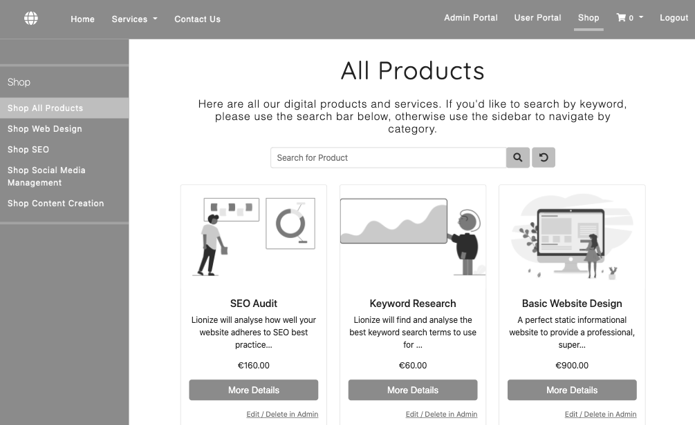
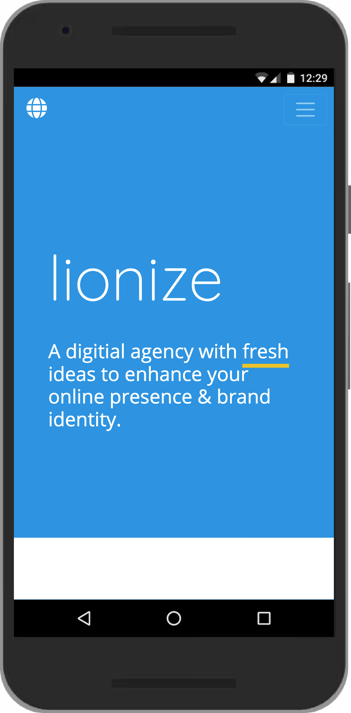
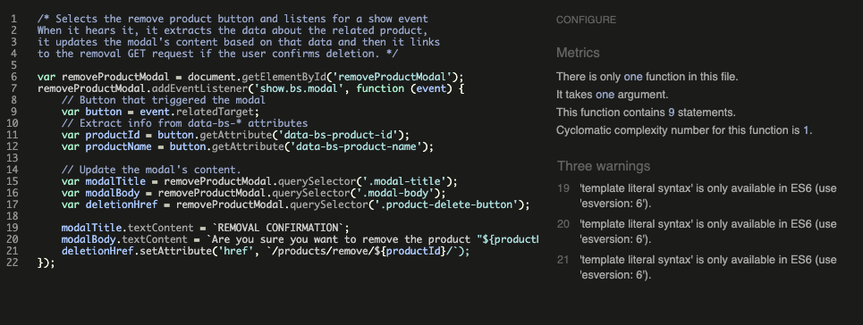
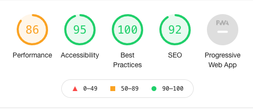
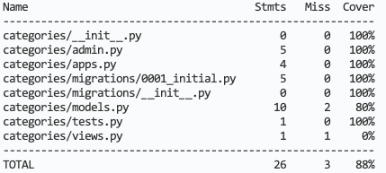

# Testing

# Testing Table Of Contents

* [**User Story Testing**](#user-story-testing)
  * [1. First Time User Goals Testing](#first-time-user-goals-testing)
  * [2. Returning User Goals Testing](#returning-user-goals-testing)
  * [3. Persona Based User Goals Testing](#persona-based-user-goal-testing)
  * [4. Accessibility User Goals Testing](#accessibility-user-goals-testing)
  * [5. Admin User Goals Testing](#admin-user-goals-testing)
  * [6. Application Creator User Goals Testing](#application-creator-user-goals-testing)
* [**Issues and bugs caught during testing**](#issues-and-bugs-caught-during-testing)
    * [1. Toast Initialization](#toast-initialization)
    * [2. Removing Items from Shopping Bag](#removing-items-from-shopping-bag)
    * [3. Development version of application css not loading](#development-version-of-application-css-not-loading)
    * [4. Deployed version of application css not loading.](#deployed-version-of-application-css-not-loading)
    * [5. Passing Data from the Homepage to an external JavaScript File.](#passing-data-from-the-homepage-to-an-external-javascript-file)
    * [6. Product Review Model Errors](#product-review-model-errors)
    * [7. First and Last Name Disconnect Issue](#first-and-last-name-disconnect-issue)
    * [8. Error in Console When Attempting to Fire Bootstrap Modal](#error-in-console-when-attempting-to-fire-bootstrap-modal)
    * [9. Changing Site Domain and Name](#changing-site-domain-and-name)
    * [10. Communicating effectively with the user on the Reviews Page](#communicating-effectively-with-the-user-on-the-reviews-page)
    * [11. Skip To Main and Autofocus](#skip-to-main-and-autofocus)
    * [12. Gmail Connection Issue](#gmail-connection-issue)
    * [13. Messages Date Updating](#messages-date-updating)
    * [14. Stripe Webhooks Race Conditions](#stripe-webhooks-race-conditions)
* [**Status Code Testing**](#status-code-testing)
    * [1. 200 Status Code Testing](#200-status-code-testing)
    * [2. 302 Status Code Testing](#302-status-code-testing)
    * [3. 403 Status Code Testing](#403-status-code-testing)
    * [4. 404 Status Code Testing](#404-status-code-testing)
* [**Functionality Testing**](#functionality-testing)
  * [**Base Functionality**](#base-functionality)
    * [1. Navigation](#1-navigation)
    * [2. Registration](#2-registration)
    * [3. Login](#3-login)
    * [4. Links](#4-links)
    * [5. Buttons](#5-buttons)
    * [6. Forms](#6-forms)
    * [7. Input Validations](#7-input-validations)
    * [8. Email](#8-email)
    * [9. Logout](#9-logout)
    * [10. Reset Password](#10-reset-password)
  * [**Advanced CRUD Functionality: Regular Users**](#advanced-crud-functionality-regular-users)
    * [User Portal](#user-portal-functionality)
        * [1. Updating Profile (Update)](#1-updating-profile-update)
        * [2. Viewing Order History and Viewing Individual Orders (Read)](#2-viewing-order-history-and-viewing-individual-orders-read)
        * [3. Viewing Your Reviews and adding a new review (Create and Read)](#3-viewing-your-reviews-and-adding-a-new-review-create-and-read)
        * [4. Editing a review (Update)](#4-editing-a-review-update)
        * [5. Deleting a review (Delete)](#5-deleting-a-review-delete)
    * [Shopping Functionality](#shopping-functionality)
        * [1. Browsing and Filtering All Products (Read)](#1-browsing-and-filtering-all-products-read)
        * [2. Browsing Product Category Pages (Read)](#2-browsing-product-category-pages-read)
        * [3. Adding products to the shopping bag](#3-adding-products-to-the-shopping-bag)
        * [4. Updating the quantity of a product in the shopping bag.](#4-updating-the-quantity-of-a-product-in-the-shopping-bag)
        * [5. Removing a product from the shopping bag.](#5-removing-a-product-from-the-shopping-bag)
        * [6. Checkout and Purchasing a Product. (Create)](#6-checkout-and-purchasing-a-product-create)
        * [7. Stripe Webhook Testing](#7-stripe-webhook-testing)
        * [8. Stripe Payment Processing Testing](#8-stripe-payment-processing-testing)

  * [**Advanced CRUD Functionality: Admin (Staff and Superuser) Users**](#advanced-crud-functionality-admin-staff-and-superuser-users)
    * [Admin Product Dashboard](#admin-product-dashboard)
        * [1. Search for Products (Read)](#1-search-for-products-read)
        * [2. Filter by Category (Read)](#2-filter-by-category-read)
        * [3. Add a New Product (Create)](#3-add-a-new-product-create)
        * [4. Edit a Product (Update)](#4-edit-a-product-update)
        * [5. Remove a Product from the Shop (Update)](#5-remove-a-product-from-the-shop-update)
        * [6. Add a Product to the Shop (Update)](#6-add-a-product-to-the-shop-update)
        * [7. Attempt to Delete a Product](#7-attempt-to-delete-a-product)
        * [8. Delete a Product (superusers only) (Delete)](#8-delete-a-product-superusers-only-delete)
    * [Admin User Dashboard](#admin-user-dashboard)
        * [1. Search for Users (Read)](#1-search-for-users-read)
        * [2. Browse Users (Read)](#2-browse-users-read)
    * [Admin Messages Dashboard](#admin-messages-dashboard)
        * [1. Browse Messages and mark resolved and mark re-open. (Update)](#1-browse-messages-and-mark-resolved-and-mark-re-open-update)

* [**Security Testing**](#security-testing)
    * [1. Testing CSRF Protection](#1-testing-csrf-protection)
    * [2. Testing the Image Field Security](#2-testing-the-image-field-security)
    * [3. Access Control Testing](#3-access-control-testing)
    * [4. Chrome Dev Tools Security Check](#4-chrome-dev-tools-security-check)
    * [5. Content Security Policy](#5-content-security-policy)
    * [6. Mozilla Observatory Security Scanning](#6-mozilla-observatory-security-scanning)
* [**Accessibility Testing**](#accessibility-testing)
    * [Lighthouse Accessibility Tests](#lighthouse-accessibility-tests)
    * [WAVE Web Accessibility Evaluation Tool](#wave-web-accessibility-evaluation-tool)
    * [Web Accessibility by Level Access](#web-accessibility-by-level-access)
    * [Keyboard Manual Testing](#keyboard-manual-testing)
    * [Screen Reader Testing](#screen-reader-testing)
* [**Browser Testing**](#browser-testing)
    * [Desktop Browser Testing](#desktop-browser-testing)
    * [Mobile Browser Testing](#mobile-browser-testing)
* [**Responsivity Testing**](#responsivity-testing)
* [**Code Validators**](#code-validators)
    * [1. HTML Validators](#1-html-validators)
        * [W3C HTML Validator](#w3c-html-validator)
        * [W3C Link Checker](#w3c-link-checker)
    * [2. CSS Validators](#2-css-validators)
        * [W3C CSS Validator](#w3c-css-validator)
    * [3. JavaScript Validators](#3-javascript-validators)
        * [JSHint](#jshint)
    * [4. Python Validators](#4-python-validators)
        * [PEP8 Online](#pep8-online)
* [**Performance and Web Development Tools Testing**](#performance-and-web-development-tools-testing)
* [**Automated Unit Tests**](#automated-unit-tests)

<br>

# User Story Testing

## First Time User Goals Testing

### *As a first time user I want to be able to...*

1. __Easily understand the purpose of the web application.__

  - The landing page is elegant and clear. The name of the business is center-stage and the tagline clearly outlines the purpose of the application: *"A digital agency with fresh ideas to enhance your online presence & brand identity"*

      __PASS__

2. __Quickly and easily understand how to navigate and access information on the website.__

  - The navbar at the top of the application is conventional and intutitive.

- The content of the homepage itself clearly tells the user what is expected of them and what "next steps" to take i.e. registering.
- The top navbar is mirrored by a footer, which also has links to all pages available to a first-time user.

    __PASS__

3. __Quickly and easily have an idea of what kinds of products are offered.__

  - The four categories of products / services are outlined under the main page heading and "Learn More" buttons are clearly visible.

    __PASS__

4. __View further details of each of the services on offer, on specific pages dedicated to that service, so as to decide if I want to avail of any of them.__

- Clicking on the "Learn More" buttons brings the user to an information page specific to that category of product, which has a further link and CTA to register.

  __PASS__

5. __View a website that is visually and creatively appealing and physically easy to look at.__

- The website is bright, colourful, but without being garish, and user experience is enhanced by its' design, not burdened.

    __PASS__

6. __Notice the login/register options and easily navigate to those pages.__

- The register and login links along the top navbar are set to the right hand side so as to distinguish them from informational pages. 
- This also makes them more noticeable. 
- The login button is also style differently to draw further attention to it and its' use.

    __PASS__

7. __Understand the purpose of user registration and the benefits thereof.__

- There is a section on the homepage called "Benefits of Registration" that covers this question for first-time users.

    __PASS__

8. __Easily register a free account using my email.
Receive an email confirmation of my registration.__

- Registration via the registration form asks for a user's email and then send a confirmation email to the user asking them to confirm their address. 

    __PASS__

## Returning User Goals Testing

### *As a returning user I want to be able to...*

### Registration, Login, Logout, & Update Data

1. __Login to my user account, using my email and password.__

- Registered users can login successfully using email and password, or indeed using their username and password.

    __PASS__

2. __Be redirected to the User Portal and easily view the various custom user pages.__

- On successful login, users are immediately redirected to their profile page, from which (on larger screens) they can view the other User Portal pages from the side navigation, or on mobile from the dropdown menus.

    __PASS__

3. __Edit my account information.__

- Profile details can be edited and updated via the Profile Page.

  __PASS__

4. __Recover my password if I forget it.__


- Passwords can be changed, whether by choice or because they have been forgotten, via the link present on the login page. A confirmation link is sent to the user's email address and they click it to select a new password.

    __PASS__
  

5. __Logout of my account.__

- User can logout at any time using the "Logout" link in the navigation.

    __PASS__


### Information Gathering

1. __Quickly navigate to the products / services information pages from anywhere on the website.__

- The links to the information pages are available to all users and are ever-present on the main navigation bar.

    __PASS__

2. __Gather more in depth information about the services and products on offer.__

- For unregistered un-authenticated users, the information pages offer good introductory information about the services and products on offer. 

- Logged in users can navigate to the shop, where they can see all the various products listed, and clicking on any of them will bring them to the products details page, where the most in-depth information can be viewed.

- Users also have the option of contacting Lionize via the contact form (also linked separately in the navigation) to ask for clarification or for any more information that they might require.

    __PASS__

3. __Easily contact Lionize to ask for specific information about the services and products on offer.__

- As abovementioned, all users have the option to contact Lionize via the Contact Form.

    __PASS__

4. __Easily find the prices of all products.__

- Users can view the product prices both in the "All Products" and category product listing pages *and* on the specific product details page. 

- The product details page also displays the VAT and the Total incl. VAT. 

- The Shopping Bag dropdown menu and shopping Bag page also display the prices of items a user has selected for purchase. 

- The Checkout Page also displays the full prices of items a User is about to purchase. 

- The order history page displays the prices of items a user has purchased previously.

    __PASS__

5. __View the reviews of other users on products/services I am interested in.__

- The product details page includes any reviews users have added for that particular product. 

    __PASS__

### User Portal

1. __View / add / update my profile details easily on a page specifically for that purpose.__

- Users are brought to their profile page immediately after they sign in. They can edit many of their profile details easily from this page.

    __PASS__

2. __Navigate to my shopping bag quickly from the user portal side bar.__

- Clicking on the "Your Shopping Bag" brings users to their shopping bag. If empty they will see an image of an empty paper bag.

    __PASS__

3. __Easily view all my past orders, and all their attendent details.__

- Clicking on the "Your Orders" link under User Portal, brings users to an exhaustive list of their past orders.
- Each individual order can also be clicked on for more details.

    __PASS__

4. __View a list of my ordered and purchased products that I can review.__

- Clicking on the "Your Reviews" link brings the user to 2 lists: 1. A list of products they can review. 2. A list of products reviews they have written. 

    __PASS__

5. __View a list of all the reviews I have written.__

- As abovementioned this is displayed on the "Your Reviews" Page.

    __PASS__

6. __Edit any of the reviews I have written.__

- The user can click the edit button under the review in question, which will bring them to the edit review page.

    __PASS__

7. __Delete any of the reviews I have written.__

- The user can click the delete button under the review in question, which will bring them to the delete review page.

    __PASS__


### Shopping

1. __Browse all products.__

- Users can browse all products on the "Shop All Products" shopping page. 

    __PASS__

2. __Easily view the prices & specific details of each product by clicking into a product details page.__

- By clicking on the "More Details" button on any of the five shopping pages, users are brought to that product's details page.

    __PASS__

3. __Browse products by category.__

- Clicking on any of the category shop pages allow users to shop by category. 

    __PASS__

4. __Filter products by keyword using a search form.__

- The search input on the "All Products" Page fulfils this role.

    __PASS__
  
5. __Add products to my shopping bag and have this visually confirmed for me.__

- Clicking "Add to Bag" on any of the product details page add that product to the user's shopping bag and prompts a toast pop-up confirming this and displaying the current bag contents.

    __PASS__

6. __Easily view all the items in my shopping bag.__

- Shopping bag contents can be viewed in 3 ways: 

  1. The toast pop-up mentioned above displays the current bag contents anytime a user updates their bag in any way. 
  2. Clicking the shopping cart icon opens a dropdown box with the shopping bag contents displayed. 
  3. Navigating to the shopping bag page under the User Portal navigation link, brings the user to the most detailed shopping bag view.

    __PASS__

7. __Update the items in my shopping bag, by adding more or less of an item.__

- A user can achieve this easily by using the quantity selector buttons on the shopping bag page.

    __PASS__

8. __Remove any item from my shopping bag.__

- Users can click the "remove" icon that sits at the end of each item row on the shopping bag page, to delete all quantities of that item from their bag.

    __PASS__


9. __Make changes to my shopping bag and see these changes reflected immediately without having to visit the shopping bag page.__

- When an item is added to the shopping bag, those changes are reflected in the toast pop-up that follows the action. 

    __PASS__

10. __Email Lionize with a custom quotation request for a specific product/service I have in mind that I cannot find in the shop.__

- The contact form link is readily available to all users.

    __PASS__

### Purchasing

1. __Purchase the products I have added to my shopping bag.__

- Clicking on the "Secure Checkout" button from the shopping bag page, or the "Checkout" button from the shopping cart dropdown will bring the user to the checkout page, where they can input their payment details and purchase their item(s).

    __PASS__

2. __Use my credit card to pay for my items.__

- The checkout page accepts credit cards. 

    __PASS__

3. __Be confident in the knowledge that my payment is being handled securely.__

- The payment portal is handled by Stripe which is secure.
- The payment portal sits under HTTPS which the user's browser will designate as secure. 
- The link to the checkout page reads "Secure Checkout" which will reassure users.
- The brief intro text on the checkout page itself tells the user it is secure. 

    __PASS__

4. __View the VAT added to both the individual products and the total cost before paying.__

- The VAT breakdown is fully detailed on the shopping bag page, and the VAT total is outlined on the checkout page.

    __PASS__

5. __Have my personal details such as name, email, phone number & address saved to my profile and automatically populate the checkout form.__

- If the user has completed the profile page form, their personal details will be prefilled on the checkout page.
- If not, when they complete the checkout page form, they can tick the box to "save this information to my profile", so it will be auto-populated the next time around.

    __PASS__

6. __See confirmation of my order after completing the checkout process.__

- An order confirmation is the first thing users see after purchasing any products successfully.

    __PASS__

7. __Receive an email confirming my order after completing the checkout process.__

- An email is sent with the order details after any product is purchased. 

    __PASS__
  
8. __Have the VAT reflected on the order confirmation.__

- The VAT charged is present on the order confirmation.

    __PASS__

9. __Navigate to my order history page and easily see a list of past orders processed with all associated information clearly outlined.__

- The order history page is accessible via the User Portal and lists orders from most recent to oldest. 

## Persona Based User Goal Testing

### Tom Lynch - Hipster Coffee Shop Owner
### *As a sole trading small business owner I want to be able to...*

1. __Order a professional looking website for my small business.__

- There are multiple web-design products on offer. 

    __PASS__

2. __See some examples of Lionize's web design work prior to ordering.__

- There are a few examples on display on the web-design inforamational page.
- Users are free to contact Lionize via the contact form to request any further details they might want.

    __PASS__

3. __Easily understand all the various web design options available to me.__

- These are clearly outlined in the product details. Including a name, description and list of features. 
- If a user has any other questions, they can contact Lionize via the contact form.

    __PASS__

4. __Easily communicate with Lionize about my requirements, my order and my billing.__

- If a user has any questions, they can contact Lionize via the contact form.

    __PASS__

### Annalise Maior - Real Estate Marketing Manager
### *As a regional marketing manager of a large corporation I want to be able to...*

1. __Delegate the social media management of our Irish branch to specialists.__

- Lionize offers multiple social media management options.

2. __Improve all social media KPIs and see a measurable return on investment.__

- Creating a social media strategy using Lionize products would lead to a measurable return on investment. 

    __PASS__

### Rosemary Geoghan - Plumbing Co. CEO
### *As the CEO of a plumbing company seeking to future-proof how we communicate with clients, I want to be able to...*

1. __Order a new ecommerce site, with an easy-to-use CMS.__

- Ecommerce websites are offered as part of Lionize's web-design products.

    __PASS__

2. __Get the project up and running and then delegate the project management & website administration to our marketing dept.__

- With a CMS attached to the website, other members of staff are able to manage it.

    __PASS__

### David Murphy - Entrepreneurial Make-up Artist
### *As a createive professional whose brand is focused around my personality, I want to be able to...*

1. __Confidently delegate social media management, secure in the knowledge that tone and content will be in keeping with my personal brand.__

- Lionize's various social media management products will fulfill this.

    __PASS__

2. __Delegate the content creation of blog posts for my website and to share on social media to increase and maintain follower engagement.__

- Lionize offers many content creation products including blog post writing that would increase follower engagement. 

    __PASS__

3. __Easily pay for content creation products as I need them.__

- The shopping and checkout sections of the application are fully functional. 

    __PASS__

## Accessibility User Goals Testing

1. __*As a user who is colourblind*__, __I want the colours and design elements used to employ sufficient contrast so that any visual cues are easily apparent.__

- The application has been fully tested for colourblind users and employs sufficient contrast across the board.

- Testing was done using the ["Web Disability Simulator"](https://chrome.google.com/webstore/detail/web-disability-simulator/olioanlbgbpmdlgjnnampnnlohigkjla?hl=en), a very useful and important tool.

__Total Colourblindness__:
<br>

<p align="center">
  
</p>

<br>

__Red / Green Colourblindness__:

<br>

<p align="center">
  
</p>

<br>

__Yellow / Blue Colourblindness__:

<br>

<p align="center">
  
</p>

<br>

  __PASS__
  
2. __*As a keyboard user*__, __I want to be able to navigate the application using the keyboard.__

- The application is fully keyboard accessible and has been thouroughly tested using just the keyboard to navigate. 
- It employs "skip to main" links on all pages.
- Focus elements are clear.

    __PASS__

3. __*As a user using screen reader technology*__, I want my screen reader to describe the page elements correctly.

- Aria-Labels have been used extensively.
- [Screen Reader](https://chrome.google.com/webstore/detail/screen-reader/kgejglhpjiefppelpmljglcjbhoiplfn?hl=en) tech has been used to test the application.

    __PASS__

## Admin User Goals Testing
### *As an application admin user I want to be able to...*

1. __Add a new product to the shop.__

- Under the Admin "Products" tab, admins can click on the "Add Product" button, fill out the form and a new product is easily and quickly added to the shop. 

    __PASS__

2. __Edit an existing product.__

- By navigation to the Products dashboard, under the Admin Portal navigation option, admin users can click to "Edit" any aspect of a product's listing. 

    __PASS__

3. __Delete a product from the shop.__

- Again, by navigating to the admin product dashboard, admin users can click the black "Delete" button. 
- They will be prompted by a modal asking them to confirm deletion, and when they do so that product is deleted. 

- However, in a late addition to the original application design, I also decided to include "Add to Shop" and "Remove from Shop" options, which are less destructive than the "Delete" option. 

    __PASS__

4. __See a list of registered users and any emails they have sent to Lionize.__

- By navigating to the User Dashboard under the Admin Portal, admin users can view an exhaustive list of the application's users.
- Various important details are also listed here. 

- By navigating to the Messages Dashboard under the Admin Portal, admin users can view an exhaustive list of messages sent by users to Lionize via the contact form.

- Admin can opt to mark each message as "Resolved" or they can "Re-Open" them if the issue needs re-opening. 

    __PASS__

## Application Creator User Goals Testing
### *As the application creator and Lionize business stakeholder I want to be able to...*

1. __Create and maintain a user-friendly platform allowing business owners, stakeholders and employees to easily see and understand the services on offer.__

- This has been achieved by this application. It is user-friendly, has prioritized a high positive user experience and the services and products on offer have been displayed and outlined in a simple, effective and aesthetically pleasing manner.

    __PASS__


2. __Ensure that the application is as accessible as possible to include as wide a variety of users as possible.__

- As already delved into during accessibility user testing, care was given to ensure the application is accessible for a wide variety of users.

    __PASS__

3. __Accept online payments from users.__

- Payments are accepted securely and records are saved to the database.

    __PASS__

4. __Increase Lionize's client base and profits through use of the website and associated ease of online orders.__

- This would be a natural corollary of the application's functionality and design. 

    __PASS__

<br>

#### back to [contents](#testing-table-of-contents) 

<br>

# Issues and bugs caught during testing

## Toast Initialization

### __Issue:__ When trying to connect Bootstrap Toasts to the Django messages framework, the toasts were not showing. The connection was working as evidenced below, but the call to .show() was not working.

<br>

This image shows that the connection is functional, as the elements are present with the correct number of items in the bag.
<p align="center">
  
</p>

However the toast was not visible.
<p align="center">
  
</p>

Inspection of its CSS illustrates that it is the .show() method that is not working.

<p align="center">
  
</p>

<br>

### __Fix__: Calling the .show() function inside the toast initialization as below, fixed the issue:


        var toastElList = [].slice.call(document.querySelectorAll('.toast'))
            var toastList = toastElList.map(function (toastEl) {
                return new bootstrap.Toast(toastEl, autohide=false).show()
            })

<br>

## Removing Items from Shopping Bag

### __Issue:__ Clicking to remove an item from the shopping bag was resulting in a 500 Internal Server Error, with no obvious errors in the code or logic.

The remove from bag view:

<p align="center">
  
</p>

The error in the console:
<p align="center">
  
</p>

### __Fix:__ By removing the code from the try & except blocks, I was able to get a clearer picture of the reason for the error, which happened to be the lack of a trailing '/':

<p align="center">
  
</p>

<br>

Adding a trailing slash in the javascript to match the urls.py file fixed the issue:

    path('remove/<item_id>/', views.remove_from_bag, name='remove_from_bag'),


    $('.remove-item').click(function(e) {
        var csrfToken = "{{ csrf_token }}";
        var itemId = $(this).attr('id').split('remove_')[1];
        var url = `/bag/remove/${itemId}/`;
        var data = { 'csrfmiddlewaretoken': csrfToken };

        $.post(url, data)
            .done(function() {
                location.reload();
            });
    })

## Development version of application css not loading.

__Issue:__ Static files stopped serving locally once I had successfully deployed to Heroku. 

__Fix:__ As part of the CI Django tutorial I had added the code ```DEBUG = 'DEVELOPMENT' in os.environ``` in my settings.py file which effectively stopped Django serving static files locally if the DEVELOPMENT variable was not present in the environment settings. Adding that variable to my env.py file fixed the issue. 

## Deployed version of application css not loading.

__Issue:__ Static files stopped serving in production once I had successfully solved the above issue. 

__Fix:__ I noticed that the S3 url for serving static files was different to the url I had in my settings. The S3 version included the region, so changing it to the variable below worked to fix this issue.

      AWS_S3_CUSTOM_DOMAIN = f'{AWS_STORAGE_BUCKET_NAME}.s3-eu-west-1.amazonaws.com'


## Passing Data from the Homepage to an external JavaScript File.

__Issue:__ In order to prefill the contact form for users who have not yet availed of their free consultation, I needed a way to pass the various pieces of user data from Django to JavaScript, as request.user.etc... did not work in an external script file.

__Fix:__ I used the data*- attribute on hidden input fields and gave the fields ids with which to reference them in the JavaScript file. In this way I was able to collect all the user data and manipulate the contact form with JavaScript as below:


        <input id="user-email" type="hidden" data-user-email="{{ request.user.email }}">
        <input id="user-first-name" type="hidden" data-user-first-name="{{ request.user.first_name }}">
        <input id="user-last-name" type="hidden" data-user-last-name="{{ request.user.last_name }}">

## Product Review Model Errors

__Issue:__ When creating my product "Review" model the following errors were thrown. 

<br>

<p align="center">
  
</p>

<br>

__Fix:__ I had referenced the UserProfile as below and I had omitted the "profiles" reference in the field definition. Changing this:

      user = models.ForeignKey('UserProfile', on_delete=models.CASCADE, related_name='review_user')

To this:

      user = models.ForeignKey('profiles.UserProfile', on_delete=models.CASCADE, related_name='review_user')

Fixed the issue.

## First and Last Name Disconnect Issue

__Issue:__ I needed a way to allow users to add/edit their first & last names on their profile page and have this reflected and updated on the Django auth user model as well as the UserProfile Model. This was important as the checkout page form specifically asks for the first & last names and it gets them from calling the ```get_full_name()``` method on the Django auth User object. 

<br>

__Fix:__ I intially tried to combine two forms on the User Portal's Profile Page, but that was overly complicated. Eventually I added code to the POST method on the User Profile form. So that when the users update their first & last names on the User Profile Model, the POST method automatically updates the User auth model as well:

            User = get_user_model()
            user_to_update = get_object_or_404(User, username=request.user)
            user_to_update.first_name = form.cleaned_data['default_first_name']
            user_to_update.last_name = form.cleaned_data['default_last_name']
            user_to_update.save()


## Error in Console When Attempting to Fire Bootstrap Modal

__Issue:__ When attempting to integrate a Bootstrap modal, it refused to fire and the following error showed in the Console:

<p align="center">
  
</p>

<br>

__Fix:__ I found [this Stack Overflow Post](https://stackoverflow.com/questions/67440523/bootstrap-v5-modal-show-issue) describing the error exactly and it directed me to place the bootrap.bundle.min.js link just before the closing body tag, instead of in the head of the page. Doing so fixed the issue.


## Changing Site Domain and Name

__Issue:__ To change my site domain from example.com to lionize.com & likewise name from example.com to Lionize, I deleted the example.com site and replaced it with a new one for lionize.com, which immediately created the following error anytime I navigated anywhere relating to the database:

<p align="center">
  
</p>

<br>

__Fix:__ First I tried to re-add example.com using the django shell by doing:

      manage.py shell
      from django.contrib.sites.models import Site
      site = Site.objects.create(domain='example.com', name='example.com')
      site.save()

This had no effect and when I tried to add the same site again, I got a uniqueness Integrity error, so it DID add it successfully, but it still wasn't working. <br>

Then I found [this issue report](https://github.com/maxking/docker-mailman/issues/12) on github that referred to the SITE_ID variable in the Django settings file. Changing that from 1 to (I assumed 2), worked and I regained access to the admin page.

Then of course I had the issue of local vs. deployed version of the site, as I realised the dangers of just deleting the site in the database, I didn't want to risk repeating that for the deployed version of the application. Instead I added a conditional SITE_ID setting, and then edited (instead of deleting) the domain & name for the deployed version, so its SITE_ID remained 1. The conditional code in settings uses the DATABASE_URL variable, as that was already present:

<p align="center">
  
</p>


## Communicating effectively with the user on the Reviews Page

__Issue:__ If the user has no current products to review, it was important to me, not to just leave the left hand column on the review page blank. If the user has yet to purchase any products the message renders as "You have not ordered any products yet." This was easily achieved in the template as the "else" clause to ``````, however it was more complicated to template a message to a user who *had* orders attached to their profile, but who had already reviewed all the orders. If you look at the code below you can see why:

      
        
            
                
                    <div class="review-border container orders-to-review">
                        <small><strong>Order #:</strong> {{order.order_number|truncatechars:12}}</small>
                        <small><strong>Order Date:</strong> {{order.date}}</small>
                        <p></p>
                        <p><strong>Category:</strong> {{item.product.category.friendly_name}}</p>
                        <p><strong> Product: </strong> {{item.product.friendly_name}}</p>
                        <a class="review-product-button button button-accent" href="#add-review">Review</a>
                    </div>
                
            
        
    
        <div class="review-border container orders-to-review text-align-center">
            <p>You have not ordered any products yet.</p>
        </div>  
    

There is no possibility of an "else" clause against "if not item.reviewed" because it looks at all the orders in the order collection. 

__Fix:__ To add a conditional message I therefore decided that I would use JavaScript to check whether the class "orders-to-review" was present in the document, as that would only be present *if* there were orders to review and if not I programmed the following to write to the page:

      if (!ordersPresent){
    ordersNotPresent.innerHTML = `<p>You have no orders to review.</p>`
    }

## Skip To Main and Autofocus 

__Issue:__ This is more of a note than an issue, when integrating the "skip to main" links on each page, I found that the autofocus widget on the forms interfered with its functioning, which has led me to conclude that autofocus itself as a mechanism is not accessibility friendly. 

It forces keyboard users to engage with whatever form is on the page, so in an example whereby they might no longer wish to be on that page, they would have to tab through an entire form before being able to access the navigation again.

__Fix:__ I deleted the autofocus functionality from my forms, instead trusting the user to click into them manually.

## Gmail Connection Issue

__Issue:__ This application is connected to a Gmail email account via 2-factor authorization and a secure app password. Everything was working perfectly and emails were delivering and then it stopped working for no apparent reason.


<br>

<p align="center">
  
</p>

<br>

- It would seem that gmail disabled the account because of the app connection.

<br>

<p align="center">
  
</p>

<br>

__Fix:__ I changed the email address I was using and reconnected everything from scratch for the new email lionizedigitalmarketing56@gmail.com and at the time of writing this, everything is functional, however as there was no obvious trigger for the last disconnection, there is no way of guaranteeing that the same won't happen again. This is unfortunate because the registration process is depedent on there being that functional email connection present.


## Messages Date Updating

__Issue:__ During testing I discovered that marking messages as Resolved and Re-Opened was overwriting their date attribute, thus making it useless in terms of organising the messages by original date of receipt.

__Fix:__ I changed the date option on the model from 

        date = models.DateField(auto_now=True)

to:

        date = models.DateField(auto_now_add=True)

Which stopped the date being overwritten each time the instance of the model was saved.


<br>

<div align="center">
    
</div>

<br>


## Stripe Webhooks Race Conditions

__Issue:__ While testing the live site I discovered that because my internet connection is always dropping, my webhooks were kicking in and sending duplicate orders more than they should be.

__Fix:__ After researching this problem in Slack and reading a long thread by ckz8780 where he explained the issue as endemic to the Boutique Ado code (where the webhook code for this project derives most of its logic), and as the webhooks *are* working correctly, I was happy to disable the webhooks for now. I did not want to keep the application running with multiple duplicate and sometimes triplicate orders. The functionality of the webhooks *is* working correctly, but needs some tinkering with. So in theory, I could go back to the webhook code and change it so that it waits a little longer before creating the duplicate order in Stripe and pushing it to the database, however this is past the remit of this project.


<br>

<div align="center">
    
</div>

<br>

#### back to [contents](#testing-table-of-contents) 

<br>

# Status Code Testing

## 200 Status Code Testing

<details>
<summary><b>click for details</b></summary>

<br>

## Guest Users

- / - __PASS__
- /webdesign - __PASS__
- /seo - __PASS__
- /social-media-management - __PASS__
- /content-creation - __PASS__
- /#contact-us - __PASS__
- /accounts/signup/ - __PASS__
- /accounts/login/ - __PASS__


<br>

<p align="center">
  
</p>

<br>

- /accounts/confirm-email/ - __PASS__
- /accounts/confirm-email/<confirmation_code>/ - __PASS__

<br>

<p align="center">
  
</p>

<br>

## Logged in Regular Users

- / - __PASS__
- /webdesign - __PASS__
- /seo - __PASS__
- /social-media-management - __PASS__
- /content-creation - __PASS__
- /#contact-us - __PASS__
- /user-portal/profile/ - __PASS__
- /bag/ - __PASS__
- /user-portal/orders - __PASS__
- /user-portal/order_history/<order_number> - __PASS__
- /user-portal/reviews - __PASS__
- /products/ - __PASS__
- /products/?q=seo - __PASS__
- /products/web-design-products/ - __PASS__
- /products/seo-products/ - __PASS__
- /products/social-media-management/ - __PASS__
- /products/content-creation-products/ - __PASS__
- /products/<product_id>:int/ - __PASS__

<br>

<p align="center">
  
</p>

<br>


- /checkout/ - __PASS__
- /checkout/checkout_success/<order_number> - __PASS__
- /accounts/logout/ - __PASS__

<br>

<p align="center">
  
</p>

<br>

- /products/edit-review/<review_id>:int/ - __PASS__
- /products/delete-review/<review_id>:int/ - __PASS__

## Logged in Admin Users

- / - __PASS__
- /webdesign - __PASS__
- /seo - __PASS__
- /social-media-management - __PASS__
- /content-creation - __PASS__
- /#contact-us - __PASS__
- /user-portal/profile/ - __PASS__
- /bag/ - __PASS__
- /user-portal/orders - __PASS__
- /user-portal/order_history/<order_number> - __PASS__
- /user-portal/reviews - __PASS__
- /products/ - __PASS__
- /products/?q=seo - __PASS__
- /products/web-design-products/ - __PASS__
- /products/seo-products/ - __PASS__
- /products/social-media-management/ - __PASS__
- /products/content-creation-products/ - __PASS__
- /products/<product_id>:int/ - __PASS__
- /products/edit-review/<review_id>:int/ - __PASS__
- /products/delete-review/<review_id>:int/ - __PASS__
- /checkout/ - __PASS__
- /checkout/checkout_success/<order_number> - __PASS__
- /accounts/logout/ - __PASS__

- /admin-product-dashboard - __PASS__
- /admin-product-dashboard?q=seo - __PASS__
- /products/add/ - __PASS__
- /products/edit/ - __PASS__

<br>

<p align="center">
  
</p>

<br>

- /products/delete/<int:product_id>/ - __PASS__
- /products/remove/<int:product_id>/ - __PASS__
- /products/addtoshop/<int:product_id>/ - __PASS__

<br>

<p align="center">
  
</p>

<br>

- /admin-user-dashboard - __PASS__
- /admin-user-dashboard?q=mariella - __PASS__
- /admin-messages-dashboard - __PASS__
- /user-portal/mark-closed/<int:message_id> - __PASS__
- /user-portal/mark-active/<int:message_id> - __PASS__


<br>

<p align="center">
  
</p>

<br>

</details>

<br>

## 302 Status Code Testing

The following url requests by the following categories of users should return a 302 redirect status code:

<details>
<summary><b>click for details</b></summary>

<br>

### Guest Users

- /user-portal/profile/ - __PASS__
- /bag/ - __PASS__
- /user-portal/orders - __PASS__
- /user-portal/order_history/<order_number> - __PASS__
- /user-portal/reviews - __PASS__

<br>

<p align="center">
  
</p>

<br>

- /products/ - __PASS__
- /products/?q=seo - __PASS__
- /products/web-design-products/ - __PASS__
- /products/seo-products/ - __PASS__
- /products/social-media-management/ - __PASS__
- /products/content-creation-products/ - __PASS__
- /products/<product_id>:int/ - __PASS__


<br>

<p align="center">
  
</p>

<br>

- /checkout/ - __PASS__
- /checkout/checkout_success/<order_number> - __PASS__
- /admin-product-dashboard - __PASS__
- /admin-product-dashboard?q=seo - __PASS__
- /admin-messages-dashboard
- /products/add/ - __PASS__

<br>

<p align="center">
  
</p>

<br>

- /products/edit/<int:product_id>/ (8) - __PASS__
- /products/delete/<int:product_id>/ (51) - __PASS__ 
- /products/remove/<int:product_id>/ (8) - __PASS__
- /products/addtoshop/<int:product_id>/ (51) - __PASS__
- /admin-user-dashboard?q=mariella - __PASS__
- /user-portal/mark-closed/<int:message_id>/ (4) - __PASS__
- /user-portal/mark-active/<int:message_id>/ (5) - __PASS__

<br>

<p align="center">
  
</p>

<br>

- /products/edit-review/<review_id>:int/ - __PASS__
- /products/delete-review/<review_id>:int/ - __PASS__

## Logged in Regular Users

- /accounts/login/
- /accounts/signup/

<br>

<p align="center">
  
</p>

<br>

## Admin Users

- /accounts/login/
- /accounts/signup/

<br>

<p align="center">
  
</p>

<br>

</details>

<br>

## 403 Status Code Testing

The following url requests by the following categories of users should return a 403 Forbidden status code:

<details>
<summary><b>click for details</b></summary>

<br>

## Logged in Regular Users

- /user-portal/order_history/<order_number>/ (not their own) - __PASS__
- /admin-product-dashboard - __PASS__
- /admin-product-dashboard?q=seo - __PASS__
- /admin-user-dashboard - __PASS__
- /admin-user-dashboard?q=mariella - __PASS__
- /admin-messages-dashboard - __PASS__
- /products/add/ - __PASS__
- /products/edit/<int:product_id>/ (8) - __PASS__
- /products/delete/<int:product_id>/ (51) - __PASS__ 
- /products/remove/<int:product_id>/ (8) - __PASS__
- /products/addtoshop/<int:product_id>/ (51) - __PASS__
- /user-portal/mark-closed/<int:message_id>/ (4) - __PASS__
- /user-portal/mark-active/<int:message_id>/ (5) - __PASS__

<br>

<p align="center">
  
</p>

<br>

- /products/edit-review/<review_id>:int/ (not their own)- __PASS__
- /products/delete-review/<review_id>:int/ (not their own)- __PASS__

<br>

<p align="center">
  
</p>

<br>

## Logged in Admin (Staff) Users

- /products/delete/<int:product_id>/ (51) - __PASS__  (only superusers are allowed delete products completely)

- /products/edit-review/<review_id>:int/ (not their own)- __PASS__
- /products/delete-review/<review_id>:int/ (not their own)- __PASS__

<br>

<p align="center">
  
</p>

<br>

</details>

<br>

## 404 Status Code Testing

The following url requests by the following categories of users should return a 403 Forbidden status code:

<details>
<summary><b>click for details</b></summary>

<br>

Any time any user types in an incorrect URL - they should receive a 404 status code.

Specifically important is that urls that are almost correct, as in they have the correct prefix, but lead to a non-existent order number for example, also return a 404 status code.

## Guest Users

- /totally-incorrect-url - __PASS__


<br>

<p align="center">
  
</p>

<br>


## Logged in Regular Users

- /totally-incorrect-url - __PASS__
- /user-portal/order_history/<incorrect order number>/ - __PASS__

<br>

<p align="center">
  
</p>

<br>

## Logged in Admin Users

- /totally-incorrect-url - __PASS__
- /user-portal/order_history/<incorrect order number>/ - __PASS__
- /products/edit/<int:incorrect_product_id>/ (999) - __PASS__
- /products/delete/<int:incorrect_product_id>/ (999) - __PASS__ 
- /products/remove/<int:incorrect_product_id>/ (999) - __PASS__
- /products/addtoshop/<int:incorrect_product_id>/ (999) - __PASS__
- /user-portal/mark-closed/<int:incorrect_message_id>/ (999) - __PASS__
- /user-portal/mark-active/<int:incorrect_message_id>/ (999) - __PASS__

<br>

<p align="center">
  
</p>

<br>

</details>

<br>

#### back to [contents](#testing-table-of-contents) 

<br>

# Functionality Testing

## Base Functionality

## 1. Navigation

__PASS__

Testing process:

- Clicked through each main navbar link to ensure they directed the user to the correct page. -- __PASS__
- Clicked through each mobile navigation link to ensure they directed the user to the correct page. -- __PASS__
- Clicked through each side navigation link to ensure they directed the user to the correct page. -- __PASS__
- Checked every navigation link on the site to ensure they linked to the correct page. -- __PASS__
- Clicked throught every external link to ensure they opened in a new browser tab. -- __PASS__
- Used W3 Link Checker to ensure there were no broken links on the page. -- __PASS__

## 2. Registration

__PASS__

Testing Process:

- Set up a temporary email address using [email on deck](https://www.emailondeck.com/).
- Filled out the registration form on the register page.
- Navigated to the email confirmation link that was sent to the temporary email address.
- Clicked on the "Confirm" button to verify the email address.
- Logged in with the email and password I just set up to verify the process worked correctly. 

<br>

<p align="center">
  
</p>

<br>


## 3. Login 

__PASS__

Testing Process:

- I created 2 dummy users, one regular user: Mariella Devalle, and one staff user: Alexandra Marsden. -- __PASS__
- I logged into each account individually to ensure that the login was functional. -- __PASS__
- I used Chrome Dev Tools in both instances to ensure that new sessions were created. -- __PASS__

<br>

<p align="center">
  
</p>

<br>

<div align="center">
    
</div>

<br>

## 4. Links

Testing Process

__PASS__

- I checked each link on the page to ensure they linked to the correct page. -- __PASS__
- I checked that each external link had both ```rel="noopener"``` and ```target="_blank"``` set on them to ensure security (former) and user experience (latter).
- I used W3 Link Checker to ensure there were no broken links. -- __PASS__


## 5. Buttons

Testing Process:

__PASS__

- Checked to ensure that all buttons with no text contained aria-labels for screen reader accessibility. -- __PASS__
- Checked that all form submit buttons, successfully POST(ed) their data, but manually confirming that data's presence in the Django backend. -- __PASS__
- Manually checked each button to ensure that they are only used to submit data and not as a substitute for link tags. -- __PASS__


## 6. Forms 

__PASS__

Testing Process:

- Submitted all forms and then immediately checked the Django backend and the application response to ensure they submitted successfully. -- __PASS__
- Submitted each form with various incorrect or forbidden inputs to ensure that the form was not submitted, that the validations were functional and that the appropriate error messages were displayed to the user. -- __PASS__

## 7. Input Validations

__PASS__

Bootstrap comes with a useful set of input/form validations, which have been used in this application to supplement Django validations. 

__1. Contact Form Validations.__

  - Django automatically uses an email validator on EmailFields, so text input in a non-email format will throw a validator error message. 


<br>

<p align="center">
  
</p>

<br>

- The subject field has 4 validators:

  - It is a required field.
  - It must have a minimum length of 1
  - It must have a maximum length of 100
  - It cannot be purely numerical.

- The message field has 4 validators:

  - It is a required field.
  - It must have a minimum length of 20
  - It must have a maximum length of 2000
  - It cannot be purely numerical.

<br>

<p align="center">
  
</p>

<br>

__2. Register Form Validations__

- These are part and parcel of the Django allauth models, but briefly here are the validations attached:

- The Email field must be in a valid email format.

<br>

<p align="center">
  
</p>

<br>

<br>

<p align="center">
  
</p>

<br>

- The emails entered must match.

<br>

<p align="center">
  
</p>

<br>

- Usernames must be a minimum of 5 characters and a maximum of 150 characters.

<br>

<p align="center">
  
</p>

<br>

- Passwords must match.

<br>

<p align="center">
  
</p>

<br>

- Passwords must be a minimum of 8 characters. (MinimumLengthValidator)


<br>

<p align="center">
  
</p>

<br>

- Passwords must not be one of 20,000 common passwords that Django checks it against. (CommonPasswordValidator)

<br>

<p align="center">
  
</p>

<br>

- Passwords must not be purely numeric (NumericPasswordValidator)

<br>

<p align="center">
  
</p>

<br>

- Passwords must not be too similar to user attributes. For example if your username is thisMightBeaGre8tPassword678 if you try and set that as your password, Django won't let you. (UserAttributeSimilarityValidator)

<br>

<p align="center">
  
</p>

<br>

__3. Login Form Validations__

- Your login details must match your registered account details. 
- Username OR Email 
- Password

Django won't tell you which one you have incorrect, to protect against the hacking of accounts. 

<br>

<p align="center">
  
</p>

<br>

__4. Profile Form Validations__

None of the profile form fields are required on the profile page, however for fields that are filled in, I have added a number of validations:
- The first_name field must not be longer than 40 characters.
- The last_name field must not be longer than 60 characters.

<br>

<p align="center">
  
</p>

<br>

- The Last Name Field must be longer than 2 characters.

<br>

<p align="center">
  
</p>

<br>

- The Phone Number field must be a number.

<br>

<p align="">
  
</p>

<br>

- The Phone Number field must be at least 5 numbers long:

<br>

<p align="">
  
</p>

<br>

- The social media fields are not required, but *if* completed the twitter, instagram & facebook fields must all include the @ symbol.

<br>

<p align="">
  
</p>

<br>

__5. Review Form Validations__

- The Review Title & Review are both required fields.

<br>

<p align="">
  
</p>

<br>

- The review title cannot be longer than 120 characters.

- The review title must be a minimum of 2 characters long.

- The review title cannot be purely numerical. 

- The review itself cannot be longer than 500 characters.

- The review must be a minimum of 20 characters long.

- The review cannot be purely numerical.

<br>

__6. Checkout Form Validations__

- Full Name, Email, Phone Number, Street Address 1, Town / City and Country are all required fields.

- The phone number must be purely numerical.

- Stripe takes care of the Payment validation - the credit card number entered must be valid.

<br>

<p align="">
  
</p>

<br>

__7. Admin: Add a new product Form__

- The Name field must be a minimum of 2 characters long.
- The Friendly_name field must be a minimum of 2 characters long.
- The Description must be a minimum of 50 characters long.
- The name, friendly_name and description fields must not be purely numerical. 

<br>

<p align="">
  
</p>

<br>

- The fields have the following max_length character limits attached to them:

    - Name: 254
    - Friendly Name: 254
    - Description: 500
    - Features: 1200
    - Price: 6 digits (with 2 decimal places)
    - ImageUrl: 1024

- The Price must be a decimal. The DecimalField field type will not allow users input a non numeric value.
- The image must be an image. The ImageField has its own validations to check that. Django validates the image uploaded using the Python Imaging Library and it will raise a validation error if the file the user is attempting to upload is not an image.

<br>

<p align="">
  
</p>

<br>

__8. Admin: Edit Product Form__

- All of the above validations apply to the edit form as well. 

## 8. Email

__PASS__

Testing Process:

- Used the contact form to send an email to the dummy Lionize email account from my dummy user "Mariella" -- __PASS__

<br>

<p align="">
  
</p>

<br>

- Verified its successful receipt by logging into the Lionize email account and reading the email. -- __PASS__

<br>

<p align="">
  
</p>

<br>

## 9. Logout

__PASS__

Testing Process:

- Logged in with my dummy Mariella account and then clicked "Logout" and then manually ensured that Mariella did not have access to any of the logged in functionality. -- __PASS__

- Visually confirmed that the successful logout message was displayed to "Mariella". -- __PASS__

<br>

<p align="">
  
</p>

<br>

- Tried again to access one of the logged in only pages e.g. /products/ and confirmed that the application redirected the now guest user to the login page.-- __PASS__

- Checked in Chrome Dev Tools to ensure that Django flushes the session variable. The session variables does not disappear from Chrome Dev Tools, but it changes to reflect the new (non-logged in) session. -- __PASS__

<br>

## 10. Reset Password

__PASS__

Testing Process:

- Navigated to the login page.
- Clicked on the "Forgot Password?" link.
- Entered a dummy email address that I have access to via email on deck. 
- Opened the email I received from Lionize. 
- Navigated to the link in the email
- Typed in a new password.
- Clicked the "Change password" button.
- Navigated back to login and entered the login email and new password.
- Verified that the new password worked.

<br>

<p align="">
  
</p>

<br>

#### back to [contents](#testing-table-of-contents) 

<br>

## Advanced CRUD Functionality: Regular Users

## User Portal Functionality

### 1. Updating Profile (Update)

Testing Process:

- Navigate to the "Your Profile" page in the User Portal.
- Alter the profile form data in some way. 
- Click the "Update Information".
- Check that the profile form now displays the new information.

<br>

<div align="center">
    
</div>

<br>

__PASS__

### 2. Viewing Order History and Viewing Individual Orders (Read)

Testing Process:

- Navigate to the "Your Orders" Page. 
- Click on any of the orders to see more details about that past order. 


<br>

<div align="center">
    
</div>

<br>

__PASS__

### 3. Viewing Your Reviews and adding a new review (Create and Read)

Testing Process:

- Navigate to and view, the "Your Reviews" Page.
- Click on the "Review" button under any of the "Products To Review".
- Add a review title. 
- Select a star rating from 1-5.
- Write the review.
- Click Submit. 
- Check that the review was added to the product details page.
- Check that the review is now in the "Your Reviews" list on the "Your Reviews" Page.
- Check that that product is no longer listed in the "Products to Review" list.

<br>

<div align="center">
    
</div>

<br>

__PASS__

### 4. Editing a review (Update)

Testing Process:

- Navigate to and view, the "Your Reviews" Page.
- Click on the "Edit" button.
- Click on "Cancel" to check functionality.
- Click back into Edit.
- Make any changes to the review. 
- Click on Update Review
- Verify the changes have been made on the review page and on the product details page.

<br>

<div align="center">
    
</div>

<br>

__PASS__

### 5. Deleting a review (Delete)

Testing Process:

- Navigate to and view, the "Your Reviews" Page.
- Click on the "Delete" button under a review.
- Click on "No, Cancel" to check functionality.
- Click back into Delete.
- Click "Yes, Delete it!" to confirm deletion.
- Verify the changes have been made on the review page and verify that that specific product is now back in the "Products to review" section of the page.

<br>

<div align="center">
    
</div>

<br>

__PASS__

## Shopping Functionality

### 1. Browsing and Filtering All Products (Read)

Testing Process:

- Navigated to the "All Products" Page in "Shop"
- Searched for "website content"
- Cleared the search field.
- Searched for "Social Media Strategy"

<br>

<div align="center">
    
</div>

<br>

__PASS__

### 2. Browsing Product Category Pages (Read)

Testing Process:

- Navigated to each of the 4 categories shop pages.
- Checked that all products were in the correct category.

<br>

<div align="center">
    
</div>

<br>

__PASS__

### 3. Adding products to the shopping bag. 

Testing Process:

- Navigated to the all products page.
- Added two items to the shopping bag.
- Viewed the shopping bag.
- Verified that those items were listed.

<br>

<div align="center">
    
</div>

<br>

__PASS__

### 4. Updating the quantity of a product in the shopping bag.

Testing Process:

- Navigated to the shopping bag page.
- Added 1 to the quantity of an item.
- Verified that it was added and that the price increased correctly.

<br>

<div align="center">
    
</div>

<br>

__PASS__


### 5. Removing a product from the shopping bag.

Testing Process:

- Navigated to the shopping bag page.
- Removed a product from the shopping bag.
- Verified that it was removed and the total price changed to reflect that.

<br>

<div align="center">
    
</div>

<br>

__PASS__

### 6. Checkout and Purchasing a Product. (Create)

Testing Process:

- Navigated to the shopping bag.
- Clicked on "Secure Checkout".
- Verified that the Form Details were entered correctly and that the form auto-populated data that it already had.
- Entered the test credit card number. 
- Clicked "Complete Order"
- Viewed checkout successful order confirmation. 
- Clicked on "Your Orders" and verified that new order is now listed at the top.
- Checked in Stripe to verify that the dummy order information was correctly received.


<br>

<div align="center">
    
</div>

<br>

### 7. Stripe Webhook Testing

Testing Process:

- Commented out the ```form.submit();``` line of code in my stripe elements JavaScript file.
- Navigated to the checkout page with an item in my shopping bag. 
- Purchased an item. 
- Navigated to Stripe to confirm that even though the form submission process was interrupted, a record of the order was still made in Stripe and sent to the database.

__PASS__

### 8. Stripe Payment Processing Testing

Testing Process:

- This was as simple as using the Test Card numbers and purchasing products. 
- Then checking in Stripe under the Payments & Developers tabs to verify that those dummy orders were processed successfully, with all attendent details attached.

__PASS__

<br>

#### back to [contents](#testing-table-of-contents) 

<br>

## Advanced CRUD Functionality: Admin (Staff and Superuser) Users

## Admin Product Dashboard

### 1. Search for Products (Read)

Testing Process:

- Navigated to the "Products" Page under Admin Portal
- Searched for "website content"
- Cleared the search field.
- Searched for "Social Media Strategy"

<br>

<div align="center">
    
</div>

<br>

__PASS__


### 2. Filter by Category (Read)

Testing Process:

- Navigated to the "Products" Page under Admin Portal
- Clicked on the various category buttons to ensure they are working correctly.

<br>

<div align="center">
    
</div>

<br>

__PASS__


### 3. Add a New Product (Create)

Testing Process:

- On the "Products" Page under Admin Portal, clicked the "Add Product Button".
- Completed the form & uploaded an illustration for the Product.
- Clicked "Add Product"
- Verified that the new product was present in the Shop and under the correct Category Page.

<br>

<div align="center">
    
</div>

<br>

__PASS__

### 4. Edit a Product (Update)

Testing Process:

- On the "Products" Page under Admin Portal, clicked on the "Edit" Button of a product.
- Altered some of the product info on the form & clicked "Update Product".
- Verified that the changes had been applied to the product in the Shop and on the Product Details Page.

<br>

<div align="center">
    
</div>

<br>

__PASS__

### 5. Remove a Product from the Shop (Update)

Testing Process:

- On the "Products" Page under Admin Portal, clicked the "Remove from Shop" button on any product.
- Verified that that button was replaced with an "Add to Shop" button.
- Navigated to the Shop to ensure that that product was nowhere to be seen. 

<br>

<div align="center">
    
</div>

<br>

__PASS__

### 6. Add a Product to the Shop (Update)

Testing Process:

- On the "Products" Page under Admin Portal, clicked the "Add to Shop" button on any product.
- Verified that that button was replaced with an "Remove from Shop" button.
- Navigated to the Shop to ensure that that product is now being displayed.

<br>

<div align="center">
    
</div>

<br>

__PASS__

### 7. Attempt to Delete a Product

Testing Process:

- On the "Products" Page under Admin Portal, clicked the "Delete" button on the "To Be Deleted" Product.
- Verified that this staff admin user was not allowed to delete the product as that ability is reserved for superusers.

<br>

<div align="center">
    
</div>

<br>

__PASS__

### 8. Delete a Product (superusers only) (Delete)

Testing Process:

- On the "Products" Page under Admin Portal, clicked the "Delete" button on the "To Be Deleted" Product.
- One the delete product page, clicked the "Yes, Delete it!" button.
- Verified that this superuser admin user was able to successfully delete the product.
- Verified that the product had been removed from the database by checking the Django backend.</s>

<br>

<div align="center">
    
</div>

<br>


__PASS__


## Admin User Dashboard

### 1. Search for Users (Read)

Testing Process:

- Navigated to the "Users" Page under Admin Portal.
- Entered "mariella" in the search bar and clicked search.
- Clicked to reset the search.

<br>

<div align="center">
    
</div>

<br>

__PASS__

### 2. Browse Users (Read)

Testing Process:

- Navigated to the "Users" Page under Admin Portal.
- Scrolled and browsed users. 

<br>

<div align="center">
    
</div>

<br>

__PASS__


## Admin Messages Dashboard

### 1. Browse Messages and mark resolved and mark re-open. (Update)

Testing Process:

- Navigated to the "Messages" Page under Admin Portal.
- Browsed the messages.
- Marked a message as "Resolved"
- "Re-Opened" another message.

<br>

<div align="center">
    
</div>

<br>

__PASS__

<br>

#### back to [contents](#testing-table-of-contents) 

<br>

# Security Testing

## 1. Testing CSRF Protection

CSRF is hard to test without actively launching an attack, however I did undertake the following checks:

### Testing Process:

- Checked that no important functionality is served by GET requests. __PASS__
- No sensitive data is passed via GET requests. __PASS__
- All POST forms are embedded with Django's CSRF protection. __PASS__

__PASS__

## 2. Testing the Image Field Security

Any application that accepts file uploads instantly opens itself to potential threats. Django's ImageField comes equipped with an image verification protection.

### Testing Process:

- I attempted to upload a non-image file into the Add Product Form.
- Firstly it would not allow me to select any files with non-image suffixes for upload. __PASS__
- When I then re-named a non-image .doc file to a .jpg, Django correctly rejected the POST request and returned an error message, regardless of the fake suffix. __PASS__

__PASS__

## 3. Access Control Testing

One of the most important security checks is that user logins are secure and that other users cannot access sensitive user data that does not pertain to them. 

The way this application is structured is by its nature very secure. All data is returned based on the login credentials passed to Django's allauth. When the application retrieves user data it does so by referencing the user id passed in via the authetication process. 

No specific data is passed through or referenced via a URL, so without the user login details or admin login credentials it is effectively impossible to gain access to user data.

As detailed above during the status code testing, I also attempted to gain access to admin pages without being logged in as an admin user, and I confirmed this was impossible. 

Data altering actions on the application are: 

1. Purchasing a product. (regular user)
2. Altering profile details. (regular user)

3. Adding a new product. (staff user)
4. Editing a product. (staff user)
5. Adding and removing products from the Shop. (staff user)

6. Deleting a product. (superuser) * This *had* been included as a GET request until reaching this security testing process, at which point, I decided that it was safer to change the delete functionality to be a POST request. So now, clicking the delete button brings the superuser to a separate delete page, where they must confirm the deletion via a CSRF protected POST request. I also decided to only grant superusers the power to delete products completely, as it is an irreversible command and given that staff users can remove products from the shop, there is really no need for them to be able to delete products completely from the database. 

*Only for the __CRUD__ requirement in the FullStacks framework assessment guidelines, I would probably remove this functionality completely from the Front End, as it is not needed there. 

7. Marking a message as resolved or open. (staff user)

__PASS__

## 4. Chrome Dev Tools Security Check

- I checked the security summary using Chrome Dev Tools and it passed. __PASS__

<br>

<div align="center">
    
</div>

<br>

<br>

<div align="center">
    
</div>

<br>

## 5. Content Security Policy

I tried to implement a CSP using django-csp with the following settings:

    # default source as self
    CSP_DEFAULT_SRC = ("'self'",
            "localhost:8000/",
            "amazonaws.com" )

    # style from our domain and bootstrapcdn
    CSP_STYLE_SRC = ("'self'",  
        "stackpath.bootstrapcdn.com",
        "cdn.jsdelivr.net",
        "https://s3.amazon.com",
        "lionize-ms4.s3-eu-west-1.amazonaws.com",
        "fonts.googleapis.com",
        "fonts.gstatic.com",
        "fontawesome.com",
        "amazonaws.com",
        "unsafe-inline",)

    # scripts from our domain and other domains
    CSP_SCRIPT_SRC = ("'self'",
        "cdn.jsdelivr.net",
        "code.jquery.com",
        "js.stripe.com",
        "https://s3.amazon.com",
        "lionize-ms4.s3-eu-west-1.amazonaws.com",
        "fonts.googleapis.com",
        "fonts.gstatic.com",
        "fontawesome.com",
        "unsafe-inline",)

    # images from our domain and other domains
    CSP_IMG_SRC = ("'self'", 
        "https://s3.amazon.com",
        "lionize-ms4.s3-eu-west-1.amazonaws.com",
        "fonts.googleapis.com",
        "fonts.gstatic.com",
        "fontawesome.com",
        "amazonaws.com")

    # loading manifest, workers, frames, etc
    CSP_FONT_SRC = ("'self'",
        "fonts.googleapis.com",
        "fonts.gstatic.com",
        "fontawesome.com" )
    CSP_CONNECT_SRC = ("'self'",)
    CSP_OBJECT_SRC = ("'self'", )
    CSP_BASE_URI = ("'self'", )
    CSP_FRAME_ANCESTORS = ("'self'", )
    CSP_FORM_ACTION = ("'self'", )
    CSP_INCLUDE_NONCE_IN = ('script-src', )
    CSP_MANIFEST_SRC = ("'self'", )
    CSP_WORKER_SRC = ("'self'", )
    CSP_MEDIA_SRC = ("'self'",
        "https://s3.amazon.com",
        "lionize-ms4.s3-eu-west-1.amazonaws.com",
        "fonts.googleapis.com",
        "fonts.gstatic.com",
        "fontawesome.com",
        "amazonaws.com", )

But no matter what combination of urls I implemented, it would not load static styles correctly.

Some resources online have referenced that newer versions of Bootstrap have become somewhat [harder to integrate into a CSP](https://github.com/twbs/bootstrap/issues/25394).

 There is definitely a way to implement this, but for now it will be added to future application improvements. The CSP was __a lot__ simpler to implement in a Flask application.

 <br>

## 6. Mozilla Observatory Security Scanning

To check a range of other security concerns, I used the [Mozilla Observatory](https://observatory.mozilla.org/) a super useful free security scanning system.

The application received a B grade when the incomplete CSP was added, however once removed it reverted to a D grade based on the lack of a CSP.

<br>

<div align="center">
    
</div>

<br>

However looking at the breakdown of categories, the overall security profile remains strong. 

<br>

#### back to [contents](#testing-table-of-contents) 

<br>

# Accessibility Testing

In addition to the accessibility user story testing outlined above, I also ran other manual & automated accessibility tests. 

## Lighthouse Accessibility Tests

The application scored highly on the lighthouse accessibility scale, and while the contrast ratio is 3.11:1 (which is acceptable by web accessibility standards), the lighthouse test still flags it as not enough contrast.

### Mobile

<br>

<div align="center">
    
</div>

<br>

### Desktop

<br>

<div align="center">
    
</div>

<br>

## WAVE Web Accessibility Evaluation Tool

This is a great tool for getting a fast overview of a website's accessibility ranking and it highlights any areas that need improvement.

The few issues it flagged were non-issues:

- It found a duplicate aria-labelledby element, which I fixed. 
- It determined that my application did not have quite enough contrast between the blue and the white, I verified this by checking the WebAIM Contrast checker and:

The application's contrast ratio was: 2.58:1 and the accessibility acceptable ratio is 3:1

- So I darkened my main blue colour until the ratio was 3.11:1 

- It took issue with there being 2 links to the home page: home & the brand icon, I think this is acceptable.
- It took issue with the skip to main link because it has a "positive tabindex". This is somewhat suprising given that it's an accessibility feature. So I can safely disregard that as well. 

<br>

<div align="center">
    
</div>

<br>

- For some reason the aria-labelledby error and the contrast errors refused to disappear from the report, even after I had corrected them, but they have been resolved.

## Web Accessibility by Level Access

I also used this accessibility checker and Lionize ranked highly here as well, passing with 0 violations out of the 266 tests run.

<br>

<div align="center">
    
</div>

<br>


## Keyboard Manual Testing

- Throughout the development process, I consistently tested the application using only my keyboard to ensure it remained fully keyboard accessible. 

__PASS__

## Screen Reader Testing

- I used Apple's voice over utility as well as the ChromeVox extension to test screen reader's ability to correctly interpret the site. 

__PASS__

<br>

#### back to [contents](#testing-table-of-contents) 

<br>

# Browser Testing

The application's functionality and appearance was tested on all major browsers. 

These are the results of that testing using [Browser Stack:](https://www.browserstack.com/)

## Desktop Browser Testing


| OS  | Browser | Version | Design Check | Functionality Check | 
| ---- | ------- | ------- | :---: | :---: |
| **Windows 7, 8, 8.1 & 10**   | *Microsoft Edge*  |  93 (dev) |  | 
|   |   | 92 (beta) |  | 
|   |   | 91 (latest) |  | 
|   |   | 90 |  | 
|   |   | 89 |  | 
|   |   | 86 |  | 
|   |   | 85 |  | 
|   |   | 84 |  | 
|   |   | 83 |  | 
|   |   | 82 |  | 
|   |   | 81 |  | 
|   |   | 80 |  | 
|   |   | 18 |  | x
|   |   | 17 |  | x
|   |   | 16 |  | x
|   |   | 15 |  | x
| **Windows 7, 8, 8.1 & 10 &**  | *Firefox*  |  90 (beta)|  | 
|  **Mac OSX Mavericks and Newer** |   | 89 (latest) |  | 
|   |   | 88 |  | 
|   |   | 87 |  | 
|   |   | 86 |  | 
|   |   | 85 |  | 
|   |   | 84 |  | 
|   |   | 83 |  | 
|   |   | 82 |  | 
|   |   | 81 |  | 
|   |   | 80 |  | 
|   |   | 79 |  | 
|   |   | 78 |  | 
|   |   | 77 |  | 
|   |    | 55 |  | 
|   |    | 54 | X | X
| **Windows 7, 8, 8.1 & 10 &**   | *Chrome*  |  93 (dev)
| **Mac OSX Mavericks and Newer**  |   | 92 (beta) |  | 
|   |   | 91 (latest) |  | 
|   |   | 90 |  | 
|   |   | 89 |  | 
|   |   | 88 |  | 
|   |   | 87 |  | 
|   |   | 86 |  | 
|   |   | 85 |  | 
|   |   | 84 |  | 
|   |   | 83 |  | 
|   |   | 82 |  | 
|   |   | 81 |  | 
|   |   | 80 |  | 
|  |   | 60 |  | 
|  |   | 59 | X | X
| **Windows 7, 8, 8.1 & 10 &**  | *Opera*  |  78 (dev) |  | 
| **Mac OSX Mavericks and Newer**  |   | 77 (latest) |  | 
|   |   | 76 |  | 
|   |   | 75 |  | 
|   |   | 74 |  | 
|   |   | 73 |  | 
|   |   | 72 |  | 
|   |   | 71 |  | 
|   |   | 68 |  | 
|   |   | 67 |  | 
|   |   | 66 |  | 
|   |   | 65 |  | 
|   |   | 47 |  | 
|    |    | 46 | X | X

For Mac systems nothing older than OSX Mavericks could successfully load the application, and for Windows nothing older than Windows 7. 

- On Windows desktops it worked perfectly on Microsoft Edge from the development version 93 until the functionality stopped working at version 18.
- On Windows & Mac desktops it worked on all versions of Firefox from v55 upwards.
- On Windows & Mac desktops it worked on all versions of Chrome from v60 upwards.
- On Windows & Mac desktops it worked on all versions of Opera from v47 upwards.

Below are three random screenshots from the desktop browser testing:

### Edge v91 on Mac Big Sur (functional)

<br>

<div align="center">
    
</div>

<br>

### Firefox v44 on Mac Catalina (not functional)

<br>

<div align="center">
    
</div>

<br>

### Opera v63 on Windows 10 (functional)

<br>

<div align="center">
    
</div>

<br>

## Mobile Browser Testing

Lionize's functionality was tested across a wide platform of mobile devices, operating systems and mobile browsers:

| Mobile Device  | OS  | Browser | Design Check | Functionality Check | 
| ---- | ------- | ------- | :---: | :---: |
| **iPhone & iPad**   | 14  |  Safari & Chrome |  | 
|   | 13  | Safari & Chrome |  | 
|   | 12 | Safari & Chrome |  | 
|   | 11  | Chrome & Safari (ipad) |  | 
|    | 11  | Chrome & Safari (iPhone) | X | X
|    | 10  | Chrome & Safari (iPad) | X | X
| **Samsung Galaxy S21, S21+, S20, S9, S8, S10+, S10e, S9+, S8+, S7, S6, S5, S4, A51, A11, A10, A8, Note 20 - Note3**  | 11,10, 9, 8, 7, 6, 5, 4.4  |  Chrome, Firefox, Samsung Internet & UC Browser|  | 
|  **Google Pixel 5, 4, 4XL, 3a, 3a XL, 3, 2, Pixel, PixelXL, Nexus6P, Nexus 6, 5, 9, 7** | 11, 10, 9, 8, 7.1, 7, 6, 5, 4.4, 5.1, 6  | Chrome, Firefox & UC Browser |  | 
|  **OnePlus 8, 7T, 7, 6T** | 10, 9  | Chrome, Firefox & UC Browser |  | 
|  **Moto G9 Play, Moto G7 Play, Moto X 2nd Gen, Moto G 2nd Gen** | 9, 6, 5  | Chrome, Firefox & UC Browser |  | 
|  **Xiaomi Redmi Note 9, 8, 7** | 10, 9  | Chrome, Firefox & UC Browser |  | 
|  **Vivo Y50** | 10  | Chrome & Firefox |  | 
|  **Oppo Reno 3 Pro** | 10  | Chrome & Firefox |  | 
|  **Huawei P30** | 9  | Chrome, Firefox & UC |  | 
|  **Xperia** | 5.1  | Chrome & UC |  | 

<br>

As the above demonstrates there are issues running the application on Apple iphones from versions 11 on Chrome and Safari. 
For some reason v11 is still functional on iPads.
V10 and down stops working on iPads as well.

Androids are far more backwards compatible, and using Browser Stack I found the application worked perfectly on all browsers and all OS versions.

Below is a selection of randomly selected screenshots of the application successfully running on a spectrum of mobile devices:

<details>
<summary><b>Open for Examples</b></summary>

1. Huawei P30 Firefox OS 9

<br>

<div align="center">
    
</div>

<br>

2. Oppo Reno 3 Pro Firefox OS 10

<br>

<div align="center">
    
</div>

<br>

3. Galaxy S4 Chrome OS 4.4

<br>

<div align="center">
    
</div>

<br>

4. Galaxy S21 Samsung Browser OS 11

<br>

<div align="center">
    
</div>

<br>

5. One Plus 7T Chrome OS 10

<br>

<div align="center">
    
</div>

<br>

6. Google Pixel 5 Chrome OS 10

<br>

<div align="center">
    
</div>

<br>

7. Xiaomi Redmi Note 8 Firefox OS 9

<br>

<div align="center">
    
</div>

<br>

</details>

<br>

</details>

#### back to [contents](#testing-table-of-contents) 

<br>

# Responsivity Testing

In addition to the extensive testing outlined in the Responsivity section of this project's README.md, I also used Chrome's [Responsive Viewer](https://chrome.google.com/webstore/detail/responsive-viewer/inmopeiepgfljkpkidclfgbgbmfcennb?hl=en) for a quick visual overview of how the webiste performs across a range of different screens. 

<br>

<div align="center">
    
</div>

<br>

I love using this tool as it allows testing the site on numerous screens simultaneously.

I also used the Chrome Dev Tools Mobile emulator __and__ I asked friends and family to test the application on their phones, tablets and browsers to flag any issues that I had not previously discovered. 

<br>

<div align="center">
    
</div>
<div align="center">
    
</div>
<div align="center">
    
</div>

<br>

# Code Validators

## 1. HTML Validators

### __W3C HTML Validator__

As many of the pages relied on being authenticated, I have to copy and paste the page sources into the checker to get an accurate assessment.

<details>
<summary><b>click for results by page</b></summary>

### 1. Homepage -- __PASS__

<br>

<div align="center">
    
</div>

<br>

### 2. Information Pages --  __PASS__

- Web Design Information Page: 

<br>

<div align="center">
    
</div>

<br>

- SEO Information Page: 

<br>

<div align="center">
    
</div>

<br>

- Social Media Management Information Page: 

<br>

<div align="center">
    
</div>

<br>

- Content Creation Information Page: 

<br>

<div align="center">
    
</div>

<br>

### 3. Register Page --  __PASS__


<br>

<div align="center">
    
</div>

<br>

### 4. Login Page --  __PASS__


<br>

<div align="center">
    
</div>

<br>

## User Portal Pages

### 5. User Profile Page --  __PASS__

The errors that remain are acceptable for the following reasons:

- The "cart-title" duplicate ID refers to the desktop and mobile versions of the shopping cart dropdown, although both are present in the source code, only one will ever be functional at a time.

- The section that lacks a heading is the form itself, but because it is just under the main page heading, this does not matter.

<br>

<div align="center">
    
</div>

<br>

### 6. Shopping Bag Page --  __PASS__

The errors that remain are acceptable for the following reasons:

- The "cart-title" duplicate ID refers to the desktop and mobile versions of the shopping cart dropdown, although both are present in the source code, only one will ever be functional at a time.

- The table row it is referring to is the last one that outlines the totals, this was included in the main table for formatting reasons and the warning really has no great impact on the page functionality.

<br>

<div align="center">
    
</div>

<br>

### 7. Order History Page --  __PASS__

The errors that remain are acceptable for the following reasons:

- The "cart-title" duplicate ID refers to the desktop and mobile versions of the shopping cart dropdown, although both are present in the source code, only one will ever be functional at a time.

- The heading refers to the fact that the order listing section has no obvious heading, but I have placed it right underneath the main page heading, so that warning is not important.

<br>

<div align="center">
    
</div>

<br>

### 8. Order Details/Checkout Success Page --  __PASS__

The errors that remain are acceptable for the following reasons:

- The "cart-title" duplicate ID refers to the desktop and mobile versions of the shopping cart dropdown, although both are present in the source code, only one will ever be functional at a time.

- The heading refers to the section encompassing the toast pop-up, which does not require a heading.

<br>

<div align="center">
    
</div>

<br>

### 9. Your Reviews Page --  __PASS__

The errors that remain are acceptable for the following reasons:

- The "cart-title" duplicate ID refers to the desktop and mobile versions of the shopping cart dropdown, although both are present in the source code, only one will ever be functional at a time.

- The aria label warning is not important, it refers to the star labels I placed on the <p> tags for the review stars which otherwise are not readable by screen readers.

<br>

<div align="center">
    
</div>

<br>

### 10. Shop All Products Page --  __PASS__

The errors that remain are acceptable for the following reasons:

- The section that lacks a heading is the product search section, it does not require a heading and the product search bar has a placeholder.

<br>

<div align="center">
    
</div>

<br>

### 11. Shop Categories Pages __PASS__

- Web Design Shop Page __PASS__

<br>

<div align="center">
    
</div>

<br>

- SEO Shop Page __PASS__

<br>

<div align="center">
    
</div>

<br>

- Social Media Management Shop Page __PASS__

<br>

<div align="center">
    
</div>

<br>

- Content Creation Shop Page __PASS__

<br>

<div align="center">
    
</div>

<br>

### 12. Product Details Page --  __PASS__

The errors that remain are acceptable for the following reasons:

- The for attr it's referring to is automatically generated by Django.

<br>

<div align="center">
    
</div>

<br>

### 13. Checkout Page --  __PASS__

The errors that remain are acceptable for the following reasons:

- The "cart-title" duplicate ID refers to the desktop and mobile versions of the shopping cart dropdown, although both are present in the source code, only one will ever be functional at a time.

- The section without a header, has a small header for "order summary" but it is a p tag because that fits in with the style of the page better.

- The last warning is a complaint about the fact that the loading spinner is nested in a h1, which was done to have control over the font-size of the spinner.

<br>

<div align="center">
    
</div>

<br>

### 14. Admin Product Dashboard --  __PASS__

The errors that remain are acceptable for the following reasons:

- The "cart-title" duplicate ID refers to the desktop and mobile versions of the shopping cart dropdown, although both are present in the source code, only one will ever be functional at a time.

- The section that lacks a heading is the product search section, it does not require a heading and the product search bar has a placeholder.

<br>

<div align="center">
    
</div>

<br>

### 15. Add Product Page --  __PASS__

The errors that remain are acceptable for the following reasons:

- The duplicate id is embedded within the Django templates widget, and has no effect on the page functionality.

<br>

<div align="center">
    
</div>

<br>

### 16. Edit Product Page --  __PASS__

The errors that remain are acceptable for the following reasons:

- The toast container does not require a heading.

- When I added an alt value to this input, it returned another error saying that this input could not have an alt attribute.

- The duplicate id is embedded within the Django templates widget, and has no effect on the page functionality.

<br>

<div align="center">
    
</div>

<br>

### 17. Delete Product Page --  __PASS__

<br>

<div align="center">
    
</div>

<br>

### 18. Admin User Dashboard --  __PASS__

The errors that remain are acceptable for the following reasons:

- The "cart-title" duplicate ID refers to the desktop and mobile versions of the shopping cart dropdown, although both are present in the source code, only one will ever be functional at a time.

- The section that lacks a heading is the product search section, it does not require a heading and the product search bar has a placeholder.

<br>

<div align="center">
    
</div>

<br>

### 19. Admin Messages Dashboard --  __PASS__

The errors that remain are acceptable for the following reasons:

- The "cart-title" duplicate ID refers to the desktop and mobile versions of the shopping cart dropdown, although both are present in the source code, only one will ever be functional at a time.

- The section that lacks a heading is the product search section, it does not require a heading and the product search bar has a placeholder.

<br>

<div align="center">
    
</div>

<br>

</details>

<br>

### __W3C Link Checker__

The 15 anchors it found were all valid.

<details>
<summary><b>click for details</b></summary>

<br>

The three outliers referenced below were 2 links (linkedin & facebook) that were not checked due to robots exclusion and the instagram link returned a "too many requests" (429) code. 

I manually checked all the links anyway and the three mentioned links work perfectly.

<br>

<div align="center">
    
</div>

</details>

<br>


## 2. CSS Validators

### __W3C CSS Validator__

All css files were formatted and auto-prefixed before running them through the validator.

<details>
<summary><b>click for results by page</b></summary>

<br>

### base.css -- __PASS__

The main css stylesheet for this project validated perfectly. 

- It did however validate with 92 warnings that all referred to "unknown vendor extensions", which is the result of using Autoprefixer to make the stylesheets more readable to all browsers, so these warnings are fine to be ignored.

<br>

<div align="center">
    
</div>

<br>

### hover-effects.css -- __PASS__

The hover effects css stylesheet for this project validated perfectly. 

- It did however validate with 72 warnings that all referred to "unknown vendor extensions", which is the result of using Autoprefixer to make the stylesheets more readable to all browsers, so these warnings are fine to be ignored.

<br>

<div align="center">
    
</div>

<br>

### checkout.css -- __PASS__

The checkout css stylesheet for this project validated perfectly. 

- It did however validate with 34 warnings that all referred to "unknown vendor extensions", which is the result of using Autoprefixer to make the stylesheets more readable to all browsers, so these warnings are fine to be ignored.

<br>

<div align="center">
    
</div>

<br>

</details>

<br>

## 3. JavaScript Validators

### __JSHint__

<details>
<summary><b>click for results by page</b></summary>

<br>

All the JavaScript files passed though the JSHint validator with only warnings about template literal syntax and the use of 'let' & 'const' as related to ES6.

### __nav.js__ -- __PASS__


<br>

<div align="center">
    
</div>

<br>

### __delete-modal.js__ -- __PASS__


<br>

<div align="center">
    
</div>

<br>

### __messages.js__ -- __PASS__

<br>

<div align="center">
    
</div>

<br>

### __script.js__ -- __PASS__

<br>

<div align="center">
    
</div>

<br>

### __reviews.js__ -- __PASS__

<br>

<div align="center">
    
</div>

<br>

### __stripe_elements.js__ -- __PASS__

<br>

<div align="center">
    
</div>

<br>

</details>

<br>

## 4. Python Validators

### __PEP8 Online__

<details>
<summary><b>click for results by page</b></summary>

<br>

<br>

### bag: __contexts.py__ -- __PASS__

<br>

<div align="center">
    
</div>

<br>

### bag: __views.py__ -- __PASS__

<br>

<div align="center">
    
</div>

<br>

### checkout: __views.py__ -- __PASS__

<br>

<div align="center">
    
</div>

<br>

### home: __views.py__ -- __PASS__

<br>

<div align="center">
    
</div>

<br>

### products: __views.py__ -- __PASS__

<br>

<div align="center">
    
</div>

<br>

### profiles: __views.py__ -- __PASS__

<br>

<div align="center">
    
</div>

<br>

<br>

</details>

<br>

#### back to [contents](#testing-table-of-contents) 

<br>

# Performance and Web Development Tools Testing

## Lighthouse

### Mobile Lighthouse Test Results

The application did well on all counts, but a little less well on mobile performace.

### Summary:

<br>

<div align="center">
    
</div>

<br>

### Performance:

<br>

<div align="center">
    
</div>

<br>

### Best Practices:

<br>

<div align="center">
    
</div>

<br>

### SEO

<br>

<div align="center">
    
</div>

<br>

### Desktop Lighthouse Test Results

The application did well on all counts.

### Summary:

<br>

<div align="center">
    
</div>

<br>

### Performance:

<br>

<div align="center">
    
</div>

<br>

### Best Practices:

<br>

<div align="center">
    
</div>

<br>

### SEO

<br>

<div align="center">
    
</div>

<br>

<br>

#### back to [contents](#testing-table-of-contents) 

<br>

# Automated Unit Tests

While this application was developed using TDD, unit tests were not used too extensively for development, however, they were integrated to a limited degree.

<details>
<summary><b>click for coverage reports by app</b></summary>

<br>

1. __Lionize__ - 63%


<br>

<div align="center">
    
</div>

<br>

2. __home__ - 64%


<br>

<div align="center">
    
</div>

<br>

3. __categories__ - 88%


<br>

<div align="center">
    
</div>

<br>

4. __checkout__ - 51%


<br>

<div align="center">
    
</div>

<br>

5. __bag__ - 50%


<br>

<div align="center">
    
</div>

<br>

6. __products__ - 46%


<br>

<div align="center">
    
</div>

<br>

7. __profiles__ - 65%


<br>

<div align="center">
    
</div>

<br>

</details>

<br>

#### back to [contents](#testing-table-of-contents) 

<br>